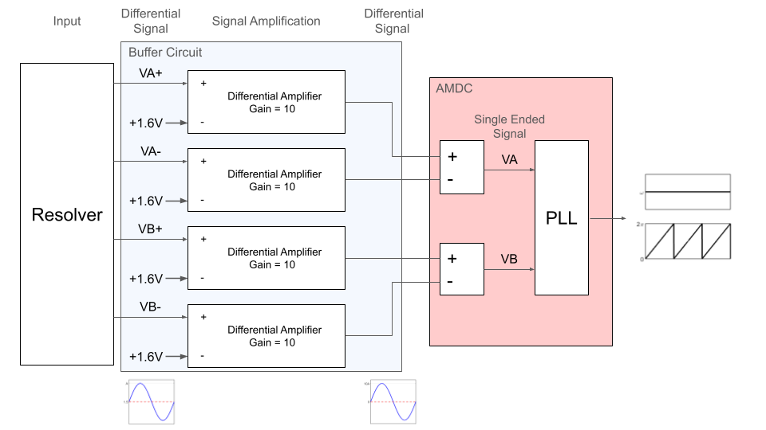

# Analog Encoder Interfacing Board
This file outlines the use of the Analog Encoder Interfacing Board and important revision changes.

## Relevant Hardware Versions

| Hardware               | Version |
|------------------------|---------|
| AMDC                   | F       |
| Super CU               | NA      |

## Revision History

| Revision |                           Changelog                           |
|----------|-------------------------------------------------------------- |
| REV A    |implements buffer circuit to amplify signal from analog encoder|

## Purpose

The Analog Encoder Interfacing Board is intended to amplify signals from analog encoder to able to measure rotor position with AMDC/SUper CU.

## Design Requirements, Considerations, and Features

### System Design Requirements
- Input Voltage: 24 VDC
- Output Voltage: 5 V
- Differential signaling

### Features

- Handles different signals 
- Removes offset for  the encoder signal 
- Amplifies the singal by 10X
- Can be used with AMDC or Super CU drive

## Block Diagram

This Analog Encoder Interfacing Board is an AMDC accessory adds the capability to read the position from the resolvers, which generates the sin/cosine signal to estimate the rotor positions.

