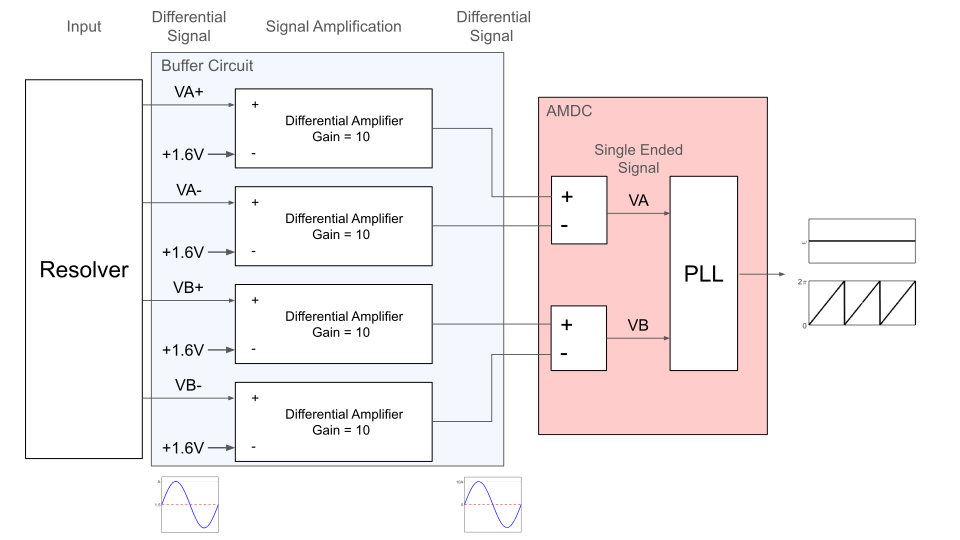

# Analog Encoder Interface Board

**This file outlines the use of the Analog Encoder Interface Board and important revision changes.**

## Relevant Hardware Versions

| Hardware               | Version |
|------------------------|---------|
| AMDC                   | F       |

## Revision History

| Revision |                           Changelog                           |
|----------|-------------------------------------------------------------- |
| REV A    |implements buffer circuit to amplify signal from analog encoder|

## Purpose

The Analog Encoder Interface Board is intended to amplify signals from an analog encoder (sin/cos outputs) to be able to measure rotor position with using the analog input ports of the AMDC.

## Design Requirements and Considerations

### Input Signals (From Analog Encoder)

This board design is designed to be compatible with the [RLS RM44 Rotary Magnetic Encoder](https://www.rls.si/eng/rm44-rm58?openConfigurator=true&partNumbers=RM44BC0001S10F2E96):

- Differential sin/cos signals
- Amplitude: 0.25V
- Offset: 1.6V

### Output Signals (To AMDC)

The goal of the board is to condition the input signals to quantities that are easily measured by the AMDC's analog interface. The output signals should meet the following specification:

- Differential sin/cos
- No DC offset
- Reside within +/- 10V range

## Block Diagram

The following block diagram illustrates how this board conditions sin/cos position signals for use by the AMDC:

The blue box shows the functionality of the Analog Encoder Interface Board. It removes the DC offset of each signal in the differential pair of encoder outputs and amplifies each signal by a gain of 10.

The red box illustrates example functionality that can be implemented in the AMDC to use the resulting signals to calculate shaft speed and position.

## External Connectors

There are 4 connectors on the boards. The details of the pinout are provided below.

### 6 pin connector J1: Encoder

| Pin number | Signal name                                           |
|------------|-------------------------------------------------------|
| 1          | 5 V                                                   |
| 2          | GND                                                   |
| 3          | VA_P                                                  |
| 4          | VA_N                                                  |
| 5          | VB_P                                                  |
| 6          | VB_N                                                  |

### 2 pin connector J2: Power supply

| Pin number | Signal name                                           |
|------------|-------------------------------------------------------|
| 1          | 24 V                                                  |
| 2          | GND_24V                                               |

### 6 pin connector J3: Drive

| Pin number | Signal name                                           |
|------------|-------------------------------------------------------|
| 1          | NC                                                    |
| 2          | GND                                                   |
| 3          | VB_N_OUT                                              |
| 4          | VB_P_OUT                                              |
| 5          | VA_N_OUT                                              |
| 6          | VA_P_OUT                                              |

### Ethernet connector J4: Board-to-AMDC

| Pin number | Signal name                                           |
|------------|-------------------------------------------------------|
| 1          | VA_P_OUT                                              |
| 2          | VA_N_OUT                                              |
| 3          | NC                                                    |
| 4          | GND                                                   |
| 5          | NC                                                    |
| 6          | GND                                                   |
| 7          | VB_P_OUT                                              |
| 8          | VB_N_OUT                                              |
