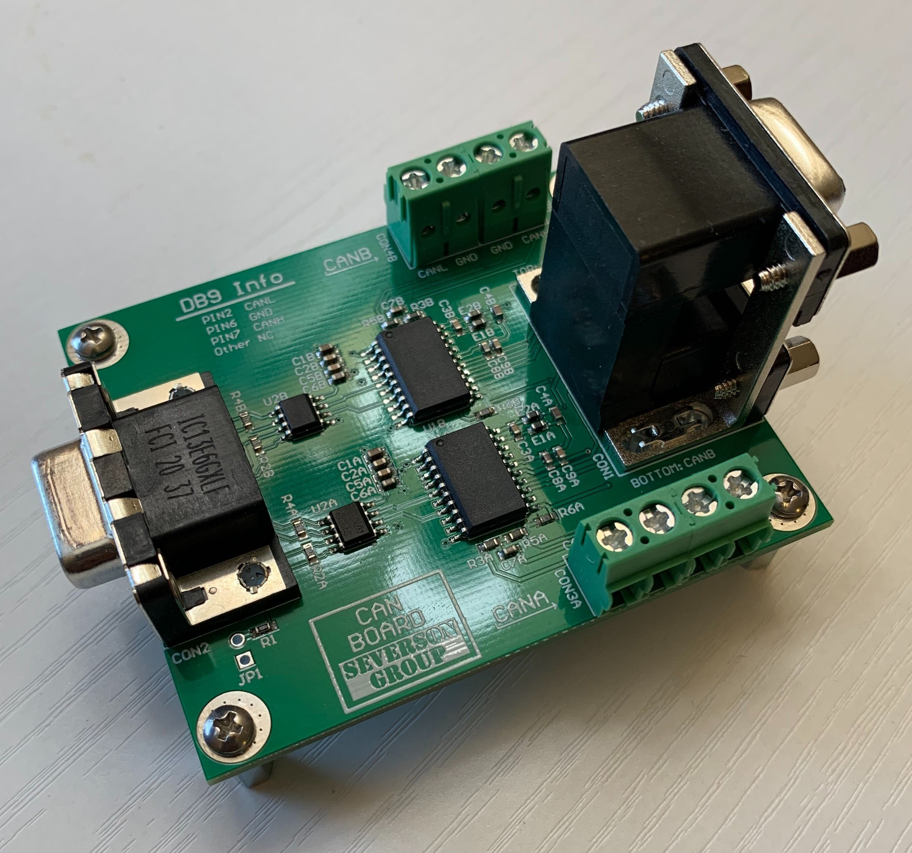
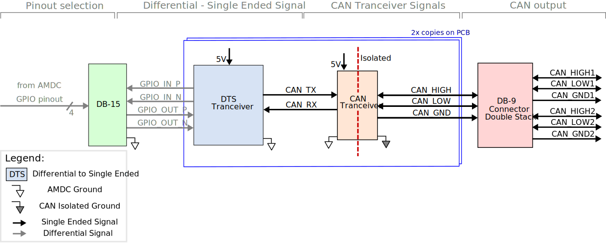

# CAN Board

This document describes the design considerations and implementation details for the CAN board. The purpose of the board is to enable the AMDC to communicate
with other nodes on a CAN bus. 

## Relevant Hardware Versions
| Board | Version |
| ----- | ------- |
| AMDC  | REV D   |
| CAN   | REV A   |

## Design Requirements and Considerations
The CAN board was designed with the following requirements: 
1. Two CAN buses
2. Individual buses should be isolated from each other
3. Include screw terminal and DB-9 connectors for CAN outputs
4. Place all components on top of the board
5. Minimal routing on the bottom layer 

## Block Diagram
Below is a block diagram illustrating the high level details about the state signals as they come from the `AMDC` board to the `CAN` board. 

Signals to and from the `AMDC` come through the `DB-15` connector. They are differential signals. These differential signals need to be converted into a single-ended signal, which is the purpose of the `DTS Tranceiver` above. As the single-end `CAN_TX` and `CAN_RX` signals go through the `CAN Tranceiver`, they are turned into a differential signal that goes on the `CAN` bus. These are the `CAN_HIGH` and `CAN_LOW` signals.

## Pin Configuration
Below is a description of the pin configuration on the high density DB-15 connector, which is the connection point to the AMDC GPIO Expansion subsystem.

| Pin # | Description |
| ----- | ------- |
| 1    | 5V Input   |
| 2     | GPIO1_IN_P   |
| 3     | GPIO1_IN_N   |
| 4     | GPIO2_IN_P   |
| 5     | GPIO2_IN_N   |
| 6     | -  |
| 7     | -   |
| 8     | -   |
| 9     | -   |
| 10     | -   |
| 11    | AMDC GND   |
| 12    | GPIO1_OUT_P   |
| 13     | GPIO1_OUT_N   |
| 14    | GPIO2_OUT_P   |
| 15     | GPIO2_OUT_N  |

The pin out on the double stack DB-9 connector is the following for both the top and bottom stack. All other pins are no connects on the connector. 
| Pin # | Description |
| ----- | ------- |
| 2  | CANL   |
| 6   | CAN_GND   |
| 7   | CANH   |

## Datasheets
- [DTS Transceiver](https://www.digikey.com/htmldatasheets/production/112178/0/0/1/st490ab.html)
- [CAN Transceiver](https://www.analog.com/media/en/technical-documentation/data-sheets/ADM3055E-3057E.pdf)
