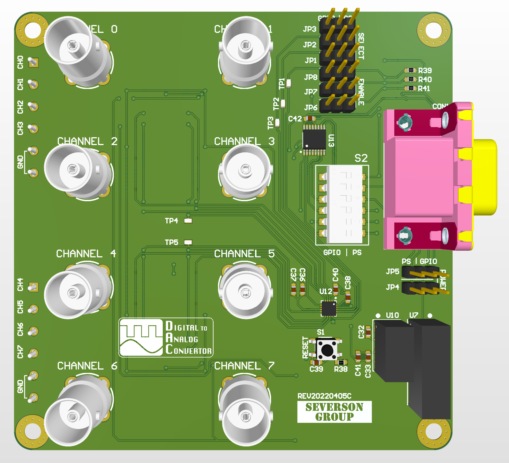

# AMDC DAC Expansion Board

The AMDC DAC expansion board is an accessory for the AMDC Rev E which provides 8 analog outputs (+- 10V output). The expansion board plugs into the AMDC via the Power Stack or GPIO interfaces. 

## Documentation

Documentation about the design of this expansion board is located at [docs.amdc.dev/accessories/dac/](https://docs.amdc.dev/accessories/dac/index.html)
