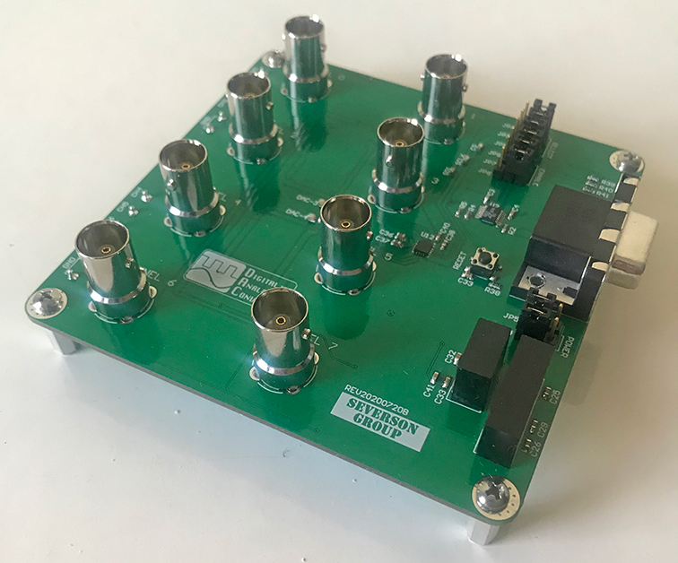
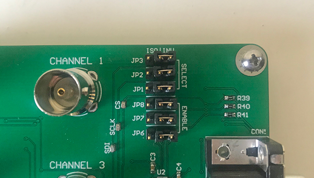
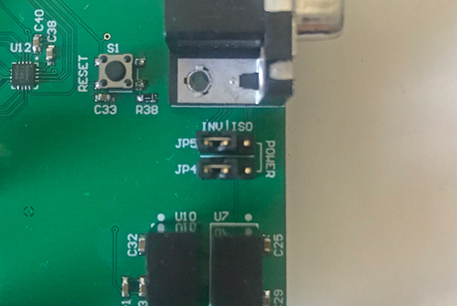

# AMDC DAC Expansion Board

This document describes the design considerations and implementation details for the AMDC Digital-to-Analog Converter (DAC) expansion board. A block diagram is presented and each component is discussed in detail. Specifications of each component are provided based on the datasheet.

## Relevant Hardware Versions

| Hardware | Version |
| ---- | ----- |
| AMDC | REV E |
| DAC Board | REV C |

> For older DAC revisions, namely AMDC REV D and DAC REV B, view the historical versions of this file.

> Pictured Below: DAC Board REV B



## Design Requirements and Considerations

The AMDC DAC expansion board was designed with the following requirements:
1. Work with both the GPIO and Power Stack AMDC ports through a single DB-15 connector
2. Minimal I/O data lines as possible (simplified SPI interface)
3. All digital and power signals on the board are isolated from the AMDC
4. Operate the DAC fast enough such that all channels have a throughput of at least 20ksps
5. Slew rate greater than 1V/us
6. 12-bit samples
7. Output Voltage: +/- 10V on all channels

## Block Diagram / External Connections

 

> Old (REV B) Block Diagram. In REV C, GPIO signals have replaced isoSPI signals.

### AMDC Connector

The AMDC DAC expansion board interfaces with the AMDC via either the Power Stack Inverter or GPIO ports, both of which use a DB-15 connector. The pinouts of the two ports differ from one another; jumpers and the S2 DIP switch are used to configure the DAC expansion board for a particular pinout. The jumper blocks and switch are discussed in greater detail later in this document.

If the Power Stack port is to be used, additional configuration of the AMDC is required. Each Power Stack port on the AMDC has four status lines. Status lines A, B, and C must be configured as outputs by jumpers on the AMDC. The voltage of the status lines must be configured to 5V in the same manner. More information about the Power Stack can be found [here](../../../docs/PowerStack.md).

For the GPIO configuration, the DAC board contains the differential-to-single chip and isolater needed to interpret SPI signals sent out from the AMDC.

A table of the pinouts for both connector types is shown below:

 
| Pin Number | Power Stack | GPIO       |
|------------|-------------|------------|
| 1          | No Connect  | `+5V`      |
| 2          | No Connect  | No Connect |
| 3          | No Connect  | No Connect |
| 4          | No Connect  | No Connect |
| 5          | No Connect  | No Connect |
| 6          | No Connect  | No Connect |
| 7          | No Connect  | No Connect |
| 8          | `STS_A`     | No Connect |
| 9          | `STS_B`     | `OUT3_P`   |
| 10         | `STS_C`     | `OUT3_N`   |
| 11         | No Connect  | `GND`      |
| 12         | No Connect  | `OUT1_P`   |
| 13         | `+5V`       | `OUT1_N`   |
| 14         | No Connect  | `OUT2_P`   |
| 15         | `GND`       | `OUT2_N`   |

### Isolators

Before the digital signals are routed to the jumpers, they are isolated from the AMDC through digital isolators. The power signals are also isolated within the DC-to-DC converters. The status lines from the Power Stack Inverter and GPIO Signal-Differentiator are each isolated using their own [ADUM130E1BRWZ](https://www.analog.com/media/en/technical-documentation/data-sheets/ADuM130D_130E_131D_131E.pdf) IC.

### Jumper Blocks/DIP Switch

There are a total of eight jumpers on the DAC board, along with a single 6-channel DIP switch, that configure the expected pinout from the DB-15 connector. 

- Jumpers JP1, JP2, and JP3 route the SPI signals used to communicate with the DAC 
- Jumpers JP4 and JP5 route the power signals to the board. 
- Jumpers JP6, JP7, and JP8 enable or disable the SPI signal digital isolator in the Power Stack Configuration. 

All eight jumpers are critical to the operation of the DAC board and must be installed on the appropriate side of the jumper blocks as designated by the silkscreen. An example installation of the Power Stack Inverter configuration can be seen below:



<br>
<br>



The 6-channel DIP switch ```S2``` is also essential. Its purpose is to protect the GPIO mode's Signal-Differentiator from the PWM signals when connected to the Power Stack. When connected to the AMDC via the Power Stack connection, all six DIP switch channels should be disconnected by moving the switches to the **OFF** position. When connected to the AMDC via the GPIO connectors, reconnect these signal lines by moving the switches to the **ON** position. The required positions for each connection mode are also marked on the silkscreen.

### DAC

The [DAC60508MC](../REV20200720B/datasheets/dac60508.pdf) 12-bit DAC was selected for its minimal SPI interface. The CS, SCLK, and MOSI lines (supplied by the AMDC) are all that's required to drive each of the eight output channels. The DAC is supplied at 5V with an internally generated _V_<sub>_REF_</sub> = 2.5V. On powerup, the DAC resets all channels' outputs to midscale which scales to 0V across the op amps. A powerup reset event can also be initiated asynchronously of the SPI interface via the onboard push button.

Each of the DAC's channels operates between 0V and _V_<sub>_REF_</sub>. The output voltage is specified by writing data over the SPI interface to an internal data register for each channel. The output voltage follows the equation:

_V_<sub>_DAC_</sub> (_CODE_) = _CODE_ / 2<sup>12</sup> x _V_<sub>_REF_</sub>

More detailed information on the operating conditions of the DAC can be found in the [datasheet](../REV20200720B/datasheets/dac60508.pdf).

### Op Amps

The DAC output voltage ranges between 0V and _V_<sub>_REF_</sub> and must be scaled to the desired range of +/- 10V before being output on the BNC connectors. To achieve this, two [OPA4192IDR](../REV20200720B/datasheets/opa4192.pdf) operational amplifiers implement the desired scaling. Each chip contains four op amps (eight in total), each of which receives a single channel output from the DAC. These Op amps receive +/- 12V supply from onboard power supplies. The non-inverting configuration used on the AMDC DAC expansion board can be seen below:


The equation for the output voltage is as follows:

_V_<sub>_out_</sub> = (_V_<sub>_DAC_</sub>) ( 1 + R<sub>3</sub> / R<sub>2</sub> + R<sub>3</sub> / R<sub>1</sub>) - (V<sub>REF</sub> x R<sub>3</sub> / R<sub>1</sub>)

More detailed information on the operating conditions of the op amps can be found in the [datasheet](../REV20200720B/datasheets/opa4192.pdf).

### LPFs

After the analog output voltage levels are scaled to the desired range of +/- 10V, low-pass filters are implemented to prevent high-frequency noise from reaching the output connectors. A single first-order RC filter is used for each analog output:


The cutoff frequency is achieved based on  the resistance and capacitance values of the filter:

_f_<sub>c</sub> = 1 / (2 π _RC_)

The LPF's cutoff frequency is set to 130kHz (a resistor with _R_ = 120Ω and a capacitor with _C_ = 10nF achieves the desired frequency).

### BNC Connectors / Screw Terminal 

There are eight BNC connectors in total (one for each DAC channel) which act as the main output connection for the analog signals. Additionally, there are twelve screw terminals, one for each channel output, and four that are ground connections. The analog voltages for each channel are linked to a single BNC connector as well as a single screw terminal. There are also [ESD protection devices](../REV20200720B/datasheets/SMDA03C-4_THRU_SMDA24C-4_N0298_REV_A.pdf) connected to the channel outputs.

## PCB Layout

Components were placed on the top layer in positions with the intent to maximize the space between the BNC connectors, as well as protect components from physical damage. All analog signals are routed on the bottom layer within the area containing the BNC connectors to shield them from noise generated by the SPI lines. In an effort to make a uniform design, any traces that could accomodate 8mil thickness are as such, to avoid going thinner than needed. Anywhere a thin trace was absolutely needed to pass between components or pins, 6mil traces were used. 

## Datasheets
- [DAC60508MC](../REV20200720B/datasheets/dac60508.pdf)
- [OPA4192IDR](../REV20200720B/datasheets/opa4192.pdf)
- [ESD Protection Devices](https://github.com/Severson-Group/AMDC-Hardware/files/8430217/SMDA03C.THRU.SMDA24C.N0297.REV.B.pdf)
