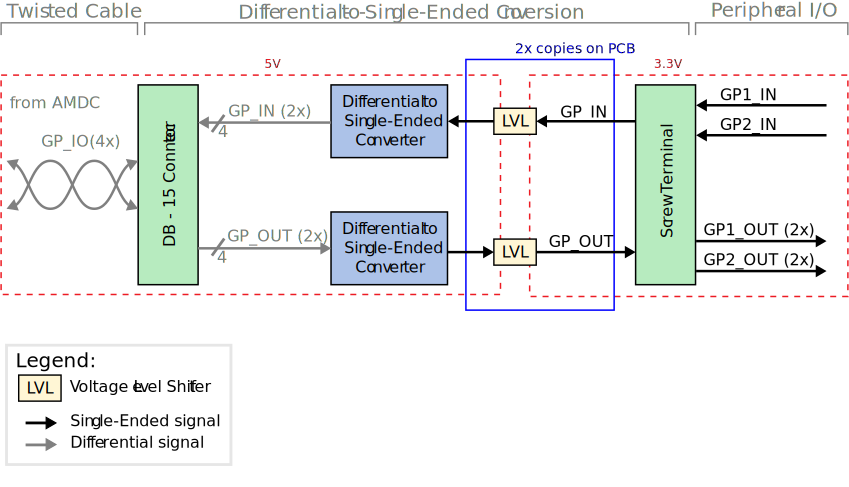

# IO Converter Expansion Board

This document describes the design considerations and implementation details for the AMDC I/O Converter expansion board.

## Relevant Hardware Versions

| Hardware | Version |
|:--------:|:-------:|
| AMDC     | REV D |
| I/O Converter Board | REV A |

## Design Requirements and Considerations

This board was designed as an external adapter that converts the 4 differential I/O from the AMDC IsoSPI port to single ended I/O. The board was designed to meet the following requirements: 

#### Differential Signals
- Signal Voltage: 5V
- Inputs: 2
- Outputs: 2
#### Single Ended Signals
- Signal Voltage: 3.3V
- Inputs: 2
- Outputs: 2x2 (The single ended outputs are duplicated to accommodate driving multiple peripheral devices)

## Block Diagram / External Connections

The AMDC I/O Converter expansion board interfaces with the AMDC via the IsoSPI port, which uses a DB-15 connector. 

### AMDC Connector

| Pin Number | Pin Name |
|:----------:|:--------:|
| 1  | 5V |
| 2  | GP1_IN_P |
| 3  | GP1_IN_N |
| 4  | GP2_IN_P |
| 5  | GP2_IN_N |
| 6  | No Connect |
| 7  | No Connect |
| 8  | No Connect |
| 9  | No Connect |
| 10 | No Connect |
| 11 | GND |
| 12 | GP1_OUT_P |
| 13 | GP1_OUT_N |
| 14 | GP2_OUT_P |
| 15 | GP2_OUT_N |

The AMDC I/O Converter expansion board interfaces with peripheral devices via leads connected to the screw post terminal.

### Screw Terminal 

| Pin Number | Pin Name | Silk Screen Marking |
|:----------:|:--------:|:-------------------:|
| 1  | GP2_OUT_3.3V | OUT 2 |
| 2  | GP2_OUT_3.3V | OUT 2 |
| 3  | GP1_OUT_3.3V | OUT 1 |
| 4  | GP1_OUT_3.3V | OUT 1 |
| 5  | GP2_IN_3.3V  | IN 2  |
| 6  | GP1_IN_3.3V  | IN 1  |