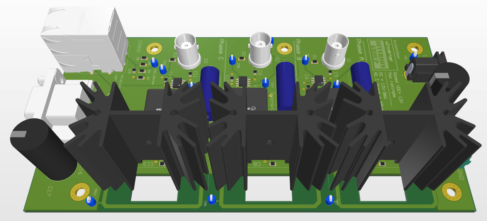

# uInverter Board

The uInverter (micro-inverter) board is an accessory for the AMDC. The purpose of this board is to serve as a low-cost, micro-level prototype board to demonstrate three-phase current regulation using the AMDC. It uses a 12V DC supply to drive a three phase RL load circuit to emulate a motor.   

## Features:    
- Three phase AC current and DC bus voltage sensing feedback to AMDC.   
- Test points to measure voltages at various locations in the supply as well as load circuits.   
- BNC connector to directly measure the current waveforms on an oscilloscope conveniently.    

## Documentation

Detailed documentation about the uInverter board is available online at: [docs.amdc.dev/accessories/uinverter](https://docs.amdc.dev/accessories/uinverter/index.html).
