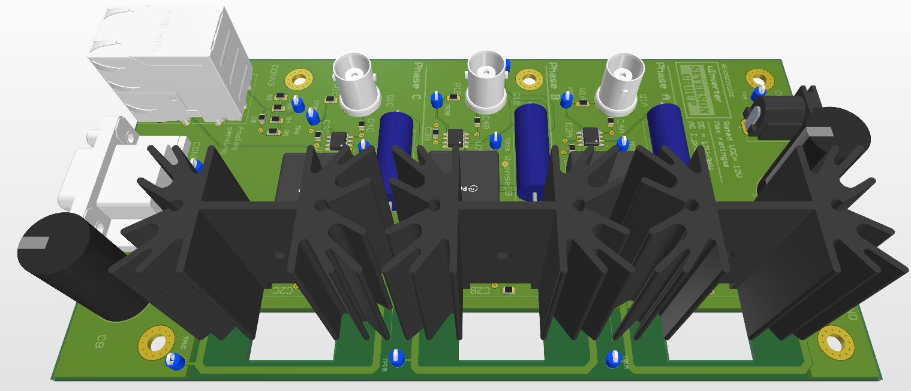

# uInverter Board

This document describes the information necessary to place an order for the fabrication of the uInverter board.  

This folder contains the compiled design outputs for the uInverter expansion board. This includes schematics, images of the PCB layout, the bill of materials (BOM) and the files needed to order fully populated boards. 

## PCB Properties
| Question          | Answer        |
|-------------------|---------------|
| Size              | 3.5" x 6.9"   |
| Number of Layers  | 2             |
| Number of components | 66         |
|Number of holes    | 196           |
| Thickness         | 1.7mm         |
| Min Track/Spacing | 6/6mil          |
| Min Hole Size     | 14mil           |
| Silkscreen        | Top Only      |
| Part Count        | 66            |

## Connectors and connections

Please check the documentation at: [docs.amdc.dev/accessories/uinverter](https://docs.amdc.dev/accessories/uinverter/index.html) for more details on the connectors and pin-outs.

**Note:** If you wish/have to replace the gate driver heatsink part number, make sure that the new part has a slot of similar dimensions as in `part no.: 529702B02500G` in the bottom to accommodate decoupling capacitors on the board.

