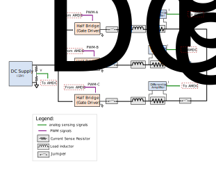
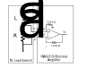

# uInverter board

This document describes the requirement and design considerations for the selection of components on the uInverter board.  

## Relevant Hardware Versions
uInverter: REV A,  AMDC: REV D

## Purpose
uInverter is an accessory board for the AMDC. The purpose of this board is to serve as a low-cost, low power micro-level board to demonstrate three-phase current regulation using the AMDC.  

##  Requirements 

The main idea behind the uInverter board is to serve as a simple, low-power benchtop setup to demonstrate three phase current regulation using AMDC. The abstract requirements of the uInverter board are outlined as follows:    
1. Emulate high speed motor circuit behavior as much as possible.  
2. Sense the DC supply voltage and phase current feedback for three phase current regulation.
3. Easy to operate using standard 12V low power off-shelf wall-wart supply.
4. Keep the board size to minimum by reducing circuit complexity. 

For the above requirements, the following specific operational requirements of the board are derived.

### Absolute Ratings
|  State variable     | Min   | Max	 | Unit |
| ------ | ----- | ----- | ---- |
| DC bus voltage : _Vdc_ | 10 |12 | V |
| Switching frequency: _fs_ | 20 | 1000 | kHz
| Load current (AC) : I_ac | 0 | 4 | A_rms
| DC Bus Voltage ripple: Δ V_dc ||  0.5 | %  
  

## Component selection

### **Gate Driver**

It is desired to reduce the circuit complexity as far as possible. Since the board is intended to be operated at low power/ current, it is possible to eliminate the switching devices and instead use an IC that can serve as a half bridge. This significantly reduces the circuit complexity, size and the number of components on board.   

The IXYS [IXDN614YI](https://www.digikey.com/en/products/detail/ixys-integrated-circuits-division/IXDN614YI/2424709?s=N4IgTCBcDaIJIA0AiA5AbARgCwE04gF0BfIA) gate driver has a continuous output current capability of 4A as source as well as sink. This gate driver serves as a half bridge arrangement. The IC works for an input voltage range of 10V to 35V. For the purpose of current regulation, this gate driver IC can be used to drive the RL load. The driver suits the application requirements well.

**Note:** If the gate driver heatsink part numer is replaced, make sure that the new part number has a slot of similar dimensions in the bottom to accommodate decoupling capacitors on the board.

###  **Current Sense Amplifier**
For three-phase current regulation, phase currents need to be sensed and fed back to the AMDC. A precision resistor is used in the phase leg to sense the phase current. A difference amplifier is used to amplify the voltage across this resistor and bring it to the voltage level suited for the analog input to AMDC. The amplifier increases the signal to noise ratio of the current sense signal.

The supply voltage available from the AMDC analog sensing connector is [±15V](https://github.com/Severson-Group/AMDC-Hardware/blob/develop/docs/Analog.md#analog-connectors). It accepts analog signal value in the range of [±10V](https://github.com/Severson-Group/AMDC-Hardware/blob/develop/docs/Analog.md#analog-connectors). 
Hence, the difference amplifier is required to work on ±15V supply and should amplify the voltage signal across the current sense resistor.
The [INA143](https://github.com/Severson-Group/AMDC-Hardware/blob/develop/docs/Analog.md#difference-amplifiers) difference amplifier, which is [used on the AMDC board](https://github.com/Severson-Group/AMDC-Hardware/blob/develop/docs/Analog.md#difference-amplifiers) works on ±15V V supply and is also capable of 0.1X or 10X gain. This differential amplifier can be used for the uInverter board with the gain setting of 10X instead of 0.1X (as on the AMDC). This also helps in homogenizing the components across accessory boards.  

While operating on the uInverter board, one of the inputs _Vi_ of the differential amplifier is connected to the floating neutral of the three-phase load. This introduces a common-mode voltage at the input of the differential amplifier. The maximum common mode voltage expected at the terminals of the amplifier can be identified by following equation:   
_Vcm = ± Vdc/2_ = (±6V)    
The [INA143U](https://www.digikey.com/en/products/detail/texas-instruments/INA143U/301019) analog difference amplifier has an acceptable common mode voltage range of [-15.4V to +15.4V](https://www.ti.com/lit/ds/symlink/ina143.pdf?ts=1620670278256&ref_url=https%253A%252F%252Fwww.ti.com%252Fproduct%252FINA143).  
Thus, this amplifier serves well in terms of the operational requirements.

### **Current Sensing Resistor**
For difference amplifier INA143U selected in the [current sense amplifier section](#diff_amplifier), the acceptable voltage at the output of the amplifier and the gain is as follows:   
 _Vout_isense_ = ± 10V.   
 Amplifier gain: _Ag_ = 10

To maximize the utilization of the available voltage for analog measurement, the shunt resistor value is selected such that the output voltage _Vout_isense_ would be maximum for the maximum current _I_ac_ = 4A.  
For this, the difference input voltage for the current sense amplifier should be equal to:     
 _Vr_isense_max_ = _Vout_isense / Ag_  
 _Vr_isense_max_ = 10 / 10 = 1 V  

The shunt resistor should have 1V drop at maximum current _i_ac_ = 5.7 A_peak.   

_R_shunt_max_ = _Vr_isense_max / I_ac_  
_R_shunt_max_ = 1V / 5.7 _A_peak_   
_R_shunt_max_ = 0.17 Ω  

 The current sense resistor [15FR150E](https://www.digikey.com/en/products/detail/ohmite/15FR150E/822919) is 0.15Ω.
  The power loss in the resistor can be found using the following equation:   
  _P_loss = I2  R_shunt_  
  _P_loss_ = 42 * 0.15  
  _P_loss_ = 2.4 W  

 The resistor is rated for 5W (ambient cooling) condition, it is a good fit for the application. 

### **Load Inductor**
A motor load can be modelled as an RL-load circuit. Each load branch consists of an inductor and a resistor load.  
For determining the value of load inductor, there are four aspects to be considered:   
1. **R/L ratio:** The purpose of the board is to demonstrate current regulation. Current regulation is predominantly used in motors for torque and speed control in numerous applications. Hence, the load R and L values are chosen to emulate real life high speed low inductance motors. Typically, the R/L ratio for [target high speed low inductance motors](#ref) lie somewhere in the range of 10 to 100 Ω/mH, with L being in the range of 20 to 100 uH. The inductor is chosen in such a way that the overall load impedence (seen by the AC source) has a R/L ratio in the above mentioned range.
2. __Resistance:__ The load inductor should have high resistance value. This eliminates the need of a separate resistor in the RL load and also reduces the number of large components on the board.
3. __Load impedance:__
Typical commutation frequency of regulation current fcw = 1kHz
For the load AC circuit, the impedance is limited by the following equation:    
    _Zm < Vac / Iac_  
    _Zm_ < 8V / 4A  
    _Zm_ < 2 Ω
4. __Ripple current:__
The maximum ripple current in the load depends on the value of inductance and is given by the following equation:    
    _ΔI =(0.25 Vdc) / (1.5 L fs)_  
    _L_: phase inductance.  

    The factor of 1.5 comes in the denominator due to the 3-phase symmetrical load condition. At any time instant, all three inductors are connected to the DC bus ( 1 series and 2 parallel).

  From the above equation, it would be desirable to have as high inductance as possible for minimizing the ripple current. However, this reduces the R/L ratio. On the other hand, if the inductance is reduced to achieve a good R/L ratio, the ripple current increases.   
  It can be observed from the above discussion that there is a tradeoff between the R/L ratio and the ripple current. To pay due diligence to the aspect of emulating behavior of physical real-life high speed - low inductance motors and at the same time minimize the ripple current, 100uH inductor [PA4344.104NLT](https://www.digikey.com/en/products/detail/pulse-electronics-power/PA4344.104NLT/5436742) is chosen. 

  _L_ = 100 uH  

 This inductor has an Equivalent Series Resistance (ESR) of 118 mΩ. Along with sensing resistor and the gate driver output resistance, the half bridge yields the R/L ratio of ~ 8. This is  close to the R/L ratio of low inductance high speed motors. Example of benchmarked motors are mentioned in the [references](#ref) section below.

### **DC link capacitor**
The main selection criterion for the DC link capacitor is the ripple voltage. The DC bus is expected to have a ripple of less than 0.5% (<0.6V) for good current regulation.
The maximum ripple in the voltage is given by -  

_ΔV = Vdc / (32  L  C  fs2)_   

For the given ripple voltage, the capacitance value required can be calculated using the above equation as follows:    

_C_ = _Vdc / (32 L  ΔV fs2)_

_C_ = 625 uF  

Considering a margin of 1.5X, capacitor [EEU-FM1V102B](https://www.digikey.com/en/products/detail/panasonic-electronic-components/EEU-FM1V102B/6109617) of 1000uF is selected.   

**Note:** The maximum allowed DC supply voltage is 12V. This is considering the safety of the components and the AMDC board in case of single-phasing or short circuit between any two phases on the uInverter board. Accidentally, if the input PWM signal of one phase is turned ON and that of another phase is turned OFF for a sufficiently long time, a DC current would flow in the phase circuit. A sustained DC current would damage the current sensing resistor and the inductor in the phase circuit on the board. It will also push the current sense amplifier in saturation, which could exceed the acceptable voltage levels at the input of the analog amplifiers on the AMDC board.   

The equivalent resistance of each phase RL branch is the sum of the gate driver's internal resistance, the equivalent series resistance of the inductor and the current sense resistance. Thus, the equivalent series resistance per phase comes out to be:   
_R_s_ ~ 0.8 Ω  
For the case mentioned above, the DC current flowing in the circuit would be:  
_I_phase (max)_ = 12V / (2*0.8Ω)  
_I_phase (max)_ = 7.5 A  

The voltage output of the current sense amplifier:  
_V_amp_ = (Amplifier gain) * (current * _R_sense_)     
_V_amp_ = (10) * (7.5A * 0.15Ω)      
_V_amp_ = 11.25 V  

When the DC supply voltage exceeds 12V, the phase current increases significantly and may push the current sense amplifier in saturation. To aviod any damage to components on the AMDC board, the DC supply voltage must be limited to no more than 12V.  

##  References 

[1] Benchmark motor specifications:  

| Motor                 | `R` (ohm) |  `L` (uH) | `R/L` (Ω/ mH) |
| -------               | ------- | ------- | ----------- |
| [Thingap - LSI-25-10](https://www.thingap.com/wp-content/uploads/2020/12/LSI-25-10-Datasheet-Rev_C.pdf)   | 0.993     | 11.878 | 83.6
| [Thingap - TG2310](https://www.thingap.com/wp-content/themes/ndic/pdf/TG2310.pdf)       | 0.31 | 20 | 15.5 |
| [Portescap - 16ECP36 Ultra EC](https://www.portescap.com/en/products/brushless-dc-motors/all-bldc-motors) | 0.47 | 40.4 | 11.7

For pinouts of the uInverter connectors and connections with AMDC. Please refer to the [uInverter_connections document](uInverter_connections.md).

