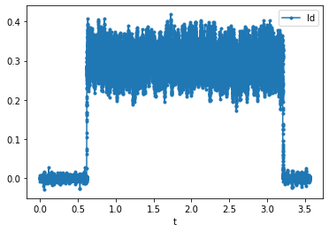

# System Identification based on Frequency Response Function

## Introduction

Controller design and tuning for any plant depends heavily on the plant parameters and hence it is important to accurately estimate the plant model.
One method to do this estimation is to take a look at the frequency response of the plant (output) to a commanded input
containing range of frequncies (e.g.: random noise)

## System ID Exercise for a 3 phase R-L load

System Identification procedure will be explained here using a three phase `R-L load` connected to an inverter as an example. It is easier to 
analyze a three phase system in synchronous reference frame and hence, applying `KVL` across the load loop in synchronous reference frame
gives a condensed voltage equation as:

`$V_{dq} (s)\ =\ RI_{dq} (s)\ +\ LsI_{dq} (s)$`

Which gives the plant (Load) transfer function as:

`$\frac{I_{dq} (s)}{V_{dq} (s)}\ =\ \frac{1}{Ls\ +\ R}\ =\ G_{plant}$`

The resistance and inductance values can be directly taken from the datasheet if the load is known. However, the actual load seen by the
inverter differs from these datasheet values because of various other contributing elements like power loop resistance, parasitic
inductance, etc.

To accurately estimate the plant parameters, a Frequency Response Function `FRF` of the plant can be generated and the plant parameters
can be extracted from that.

To generate a plant's frequency response, following steps can be followed:

1. A noise signal `V*` should be injected into the plant (If there is any other
element (like a controller) in the loop, make sure to bypass it (by making controller bandwidth very low)). In synchronous reference
frame, a noise voltage in d-axis or q-axis circuit `Vd* or Vq*`,can be injected one at a time.

2. Capture the current signal in time domain, generated in response to the injected noise for about `1 second`

3. The frequency response function `FRF`, `$(V(s)/I(s))$` can be generated using the `generateFRF` MATLAB function as shown in figure below
(Check example code, [`Plot_FRF.m`](./Scripts/Plot_FRF.m) and [`generateFRF.m`](./Scripts/generateFRF.m))

Example Frequency Response Function of the `R-L load`:

4. The frequency response function `FRF` is also the inverse of the load impedance `$(1/Z(s))$` (i.e. admittance). For lower frequencies, the load can be 
estimated as a purely resistive load and for higher frequencies, the load can be estimated as a purely inductive load

5. Estimated resistance, `$R_{estimated}$` can be found by taking the inverse of the curve fitted value of `FRF` at low frequencies and 
estimated inductive reactance, `$X_{L-estimated}$` can be found by taking the inverse of the curve fitted value of FRF at low frequencies.
The value of inductance can be subsequently found using the `$X_L$` value
 

The datasheet values for the `R` and `L` in the example case were `0.25 Ohm` and `100 uH` respectively. However, as it turns out, after performing 
the system identification the estimated `R` and `L` values turn out to be `0.65 Ohm` and `121 uH`!

### Understanding the FRF Plot

The output of the `generateFRF()` function is four vectors: a vector of `frequencies`, then three vectors `magnitude, phase and coherence` 
for values at each of these frequencies. The magnitude and phase output can be plotted to obtain the FRF function. 
But what is the `coherence` output used for?

#### Coherence

Coherence is a statistical measure that indicates the relationship between the input and output data. It will always be between zero and one. 
For an ideal constant parameter linear system with a single input `x(t)` and single output `y(t)`, the coherence will be equal to one.

However, in the physical world an ideal linear system is rarely realized, noise is an inherent component of system measurement, and it is 
likely that a single input, single output linear system is insufficient to capture the complete system dynamics. Thus, the coherence will 
be less than one. If the coherence is less than one but greater than zero it is an indication that either: noise is entering the measurements, 
that the assumed function relating `x(t)` and `y(t)` is not linear, or that `y(t)` is producing output due to input `x(t)` as well as other inputs. 
If the coherence is equal to zero, it is an indication that `x(t)` and `y(t)` are completely unrelated.

From the above discussion, it is important to always plot the coherence of the `FRF`, with the goal of it approaching one across all frequencies. 
If the coherence is low, the FRF data cannot be used to draw conclusions.

## After System Identification!

As mentioned before, the controller design for any plant depends heavily on the plant parameters and inaccurate estimation of these 
parameters would lead to inaccurate tuning of the controller. To check for the controller performance a similar FRF can be obtained 
by injecting reference noise (e.g.: `Id*`) and capturing the resultant current `Id` in time domain and then plotting the FRF as explained 
above. 

The effect of accurately estimating the plant parameters for tuning can 
be seen in figures below, where the intended bandwidth is `100 Hz` and the bandwidth before system identification (Considering datasheet 
values of `R` and `L`) was around `20 Hz`! The bandwidth after using the estimated values from system identification is around `100 Hz`, which is as required.

Before tuning:

After tuning:

This effect can be seen in the time domain as well, where we can see that the resulting current is more responsive to the noise when the controller is tuned 
using the estimated `R` and `L` values

Current response before tuning:

Current response after tuning:

