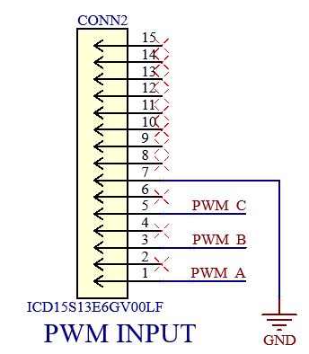
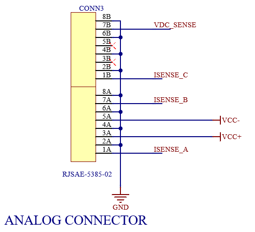
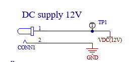

# uInverter Board

This document decribes the details of the connections on the uInverter board. For detailed review of the connections, please refer [schematics](https://github.com/Severson-Group/AMDC-Hardware/tree/uinv-rev-a-pcb/Accessories/ExpansionBoard_uInverter/REV20210506A/uInverter-rev-a.pdf).

## Connections with the AMDC

### PWM connection
The PWM connector on the uInverter board uses DB15 connector, similar to the one on the AMDC. Three phase PWM signals `A+`, `B+`, `C+` signals generated on the AMDC and are carried over to the uInverter on this connector `CONN2` - `PWM`. This is the same as that on the AMDC, and hence, can be plugged and play.
Following are the pin connections -  

> `A+` -> `PIN-1`  
> `B+` -> `PIN-3`  
> `C+` -> `PIN-5`  

### Analog connection
For providing feedback of current and voltage (analog sensing), uInverter board also uses similar RJSAE connector, as the one on the AMDC. Three phase current signals and the DC link voltage signal `ISENSE_A`, `ISENSE_B`, `ISENSE_C` and `VDC_SENSE` signals generated on the uInverter and are fed back to the AMDC using connector `CONN3` - `ANALOG SENSING`. This is the same as that on the AMDC, and hence, can be plugged and play.
Following are the pin connections -  

> `ISENSE_A` -> `PIN-1A`  
> `ISENSE_B` -> `PIN-7A`  
> `ISENSE_C` -> `PIN-1B`
> `VDC_SENSE` -> `PIN-7B`  

### DC Voltage Connector
The `12V` DC supply uses a barrel jack connector with ground-centre as marked on the PCB. Here is the [link to the datasheet of the connector](https://www.digikey.com/en/products/detail/cui-devices/PJ-037AH/1644547).  
Here is an example of a usable [12V wall-wart connector](https://www.digikey.com/en/products/detail/phihong-usa/PSAA30R-120-R-CNR1/3061648). A phoenix connector `J7` is also provided for an alternative 12V supply connection.    

### Jumper connection
The phase connection Phoenix connectors are normal-closed (NC) connections. Hence, jumpers should be used to short ONLY the following connectors - `J1,J1, J3, J4, J5, J6`. Here is a link to an example [phoenix contact jumper](https://www.digikey.com/en/products/detail/phoenix-contact/3030161/2263931?s=N4IgTCBcDaIMwAZEEYBsyQF0C%2BQ).  

For more details, please refer the [schematics](https://github.com/Severson-Group/AMDC-Hardware/tree/uinv-rev-a-pcb/Accessories/ExpansionBoard_uInverter/REV20210506A/uInverter-rev-a.pdf).

