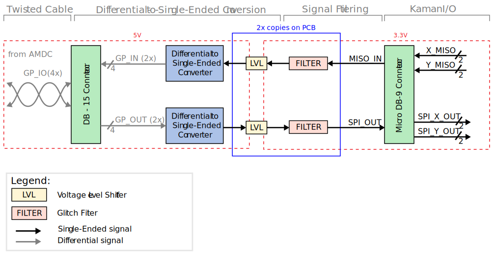

# Kaman I/O Converter Board

This document describes the design considerations and implementation details for the Kaman I/O Converter board.

## Relevant Hardware Versions

| Hardware | Version |
|:--------:|:-------:|
| AMDC     | REV D |
| Kaman I/O Converter Board | REV B |

## Revision History
| Revision | Changelog |
|----------|-----------|
| REV B | <li>specifically designed for the Kaman KD-5690-FE eddy current sensor</li><li>general purpose screw post outputs were replaced with the specific DSUB micro 9-D connector used by the Kaman sensor</li><li>pads for glitch filters and passive filters were added to increase the boards noise immunity</li>|
| REV A | <li>implements a general purpose differential to single ended I/O converter. No filters are present on the board</li>|

## Design Requirements and Considerations

This board was designed as an external adapter that converts the 4 differential I/O from the AMDC IsoSPI port to single ended I/O for the Kaman sensor. The board was designed to meet the following requirements:

#### Differential Signals
- Signal Voltage: 5V
- Inputs: 2
- Outputs: 2

#### Single Ended Signals
- Signal Voltage: 3.3V
- Inputs: 2
- Outputs: 2x2 (The single ended outputs are duplicated to accommodate driving multiple ADCs on the Kaman sensor)

## Block Diagram

## Glitch Filtering
The Kaman I/O Converter Board REV B features glitch filters implemented using cascading Schmitt-Triggers. The glitch filters were included to remove digital noise propagating from the Kaman PCB to the Converter Board PCB. Each glitch filter consists of two Schmitt-Triggers preceded by a 16MHz LPF and 1MHz LPF respectively. The low pass filters prevent short errant pulses and noise from propagating through, corrupting the SPI data from the Kaman sensor. The LPF corner frequencies were chosen based on LTspice simulation approximating the noise that was physically measured on the Kaman SPI line. The 16MHz LPF is intended to reduce high frequency noise/ripple on the data line, while the 1MHz LPF is intended to reject short pulses/glitches that are propagated through the data line. 1MHz is the maximum expected clock frequency of the data line.

While cascading the Schmitt-Triggers can prevent metastability issues, they were initially chosen to be cascaded from experience with this "cookbook" design. This is a filter arrangement that had been used in the past with success and the topology was applied here. This design can likely be implemented with a single non-inverting Schmitt trigger.

The LPF corner frequencies will need to be tuned once the board is complete as the noise characteristics will change. The added propagation delay needs to be accounted for in the SPI receiver of the AMDC.

### Schmitt-Triggers

More information about cascading Schmitt-Triggers can be found [here](https://arxiv.org/pdf/2006.08415.pdf).

The Kaman I/O Converter board interfaces with the AMDC via the IsoSPI port, which uses a DB-15 connector.

## External Connectors 
### AMDC Connector

| Pin Number | Pin Name |
|:----------:|:--------:|
| 1  | 5V |
| 2  | GP1_IN_P |
| 3  | GP1_IN_N |
| 4  | GP2_IN_P |
| 5  | GP2_IN_N |
| 6  | No Connect |
| 7  | No Connect |
| 8  | No Connect |
| 9  | No Connect |
| 10 | No Connect |
| 11 | GND |
| 12 | GP1_OUT_P |
| 13 | GP1_OUT_N |
| 14 | GP2_OUT_P |
| 15 | GP2_OUT_N |

The Kaman I/O Converter board interfaces with the Kaman sensor through a DSUB micro 9-D connector.

### Kaman Connector
| Pin Number | Pin Name |
|:----------:|:--------:|
| 1  | 24V |
| 2  | XCNV |
| 3  | XSCLK |
| 4  | XMISO |
| 5  | GND |
| 6  | YCNV |
| 7  | YSCLK |
| 8  | YMISO |
| 9  | GND |

The digital input voltage to the Kaman sensor is supplied externally through the screw post terminal.

### Screw Terminal

| Pin Number | Pin Name |
|:----------:|:--------:|
| 1  | 24V |
| 2  | GND |
| 3  | GND |
| 4  | GND |
