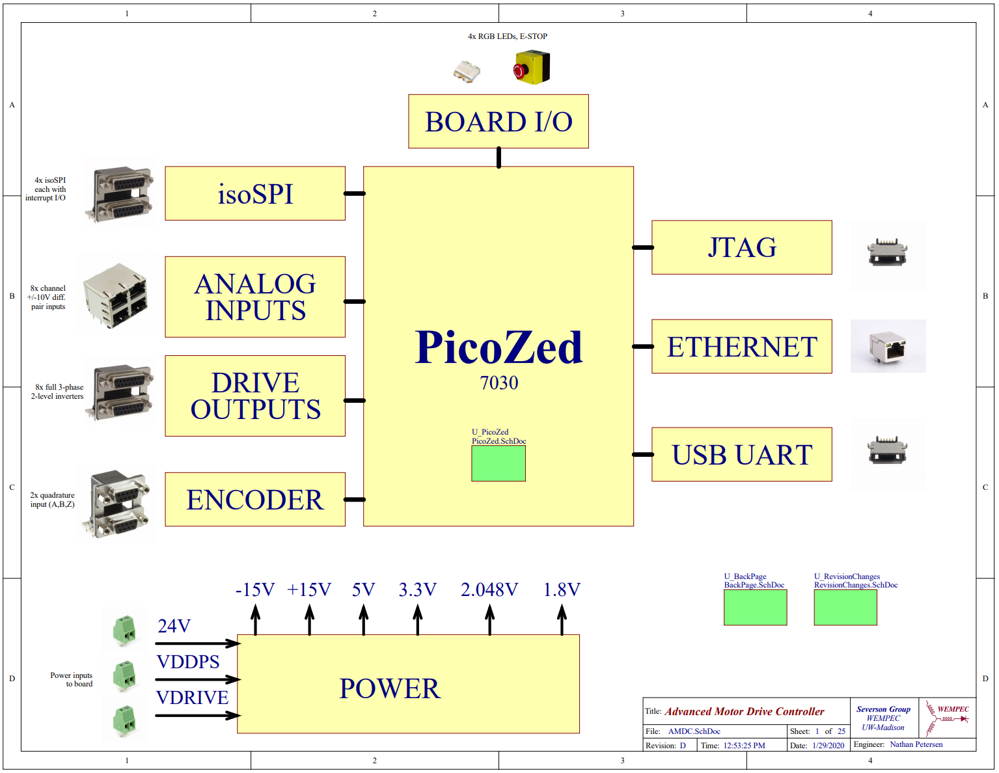

# Advanced Motor Drive Controller (AMDC) Hardware

*The Advanced Motor Drive Controller (AMDC) is an open-source project from the [Severson Research Group](https://severson.wempec.wisc.edu/) at [UW-Madison](http://www.engr.wisc.edu/department/electrical-computer-engineering/), affiliated with [Wisconsin Electric Machines and Power Electronics Consortium (WEMPEC)](https://wempec.wisc.edu/).*

Learn more at [docs.amdc.dev](https://docs.amdc.dev/).

---

**AMDC-Hardware** is a collection of circuit board designs which are used to control advanced motor systems. The hardware design is open-source, modular, and research-oriented.

The flagship circuit board is the main AMDC (see latest design [here](https://github.com/Severson-Group/AMDC-Hardware/tree/develop/REV20210325E)) which is a carrier board for the [PicoZed System-on-Module](https://www.avnet.com/wps/portal/us/products/avnet-boards/avnet-board-families/picozed/). The PicoZed is a module itself which contains the core requirements for the [Xilinx Zynq-7000](https://www.xilinx.com/products/silicon-devices/soc/zynq-7000.html) System-on-Chip. The Xilinx Zynq-7000 SoC is a powerful processor with dual-core DSPs and a tightly integrated FPGA.

Extensive firmware support is provided in the [AMDC-Firmware](https://github.com/Severson-Group/AMDC-Firmware) repo which targets this architecture.

## Repository Structure

The `altium` directory contains all files pertaining to schematics / board design in Altium Designer. These files should be the latest working copy of the project.

The `REVyyyymmdd*` directories represent snapshots of the project that were used to produce a physical PCB. These directories contain the *Gerber*, *Drill* (Excellon format), *Bill of Materials* (CSV), and *Schematic* (PDF) files.
- `REV` indicates a revision of design for manufacturing
- `yyyymmdd` indicates the date on which design was frozen
- `*` (letter) indicates which revision in sequence (A - first, B - second, etc.)

### Accessory Boards

Numerous accessory circuit boards are designed to work with the AMDC (e.g., DAC, TestBoard, CAN expansion, I/O expansion).

These are located in the [`/Accessories/`](https://github.com/Severson-Group/AMDC-Hardware/tree/develop/Accessories) subfolder. Each accessory board follows the same repo set-up conventions as desribed above for the main AMDC.

## Interfaces

The AMDC is designed for research environments where flexible and plentiful I/O are required.

The provided interfaces include:
- 48 digital output channels (designed to provide PWM signals for 8 three phase, two level inverters)
- 8 analog input channels (+/- 10V differential input)
- 4 GPIO expansion ports (differential I/O)
- 2 quadrature encoder input

## Getting Started

The AMDC-Hardware project is open-source -- contributors are welcome!

### Ordering Hardware

The `REVxxxx/` output folder contains the compiled design files needed to order hardware:
1. Review the board design using the 3D renderings and the schematics PDF
2. Check the `docs/` folder for any imformation about the board design
3. Order PCB blanks using the gerber files in the `REVxxxx/gerbers/` folder and the specs provided in the `README.md` file
4. Order components using the BOM file provided as CSV

### Designing Modifications

Note: all board designs are created using Altium Designer -- a license is required to design boards for the AMDC-Hardware project.

The `altium/` subfolder contains the latest design files for the board.

## Documentation

Detailed documentation about the hardware is available online at: [docs.amdc.dev/hardware](https://docs.amdc.dev/hardware/).

The documentation explains the design narrative and process, design choices, requirements, relevant equations and diagrams, etc.

## Background

This project originated as [Nathan Petersen's](https://github.com/npetersen2) Independent Study project during Spring 2018, advised by Prof. Eric Severson. It is now actively maintained by the [Severson Research Group](http://severson.wempec.wisc.edu/). Open source firmware is available on GitHub in the [AMDC-Firmware](https://github.com/Severson-Group/AMDC-Firmware) repository.
