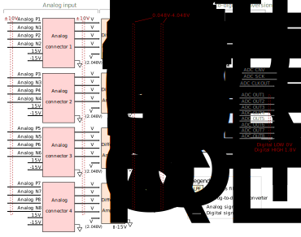
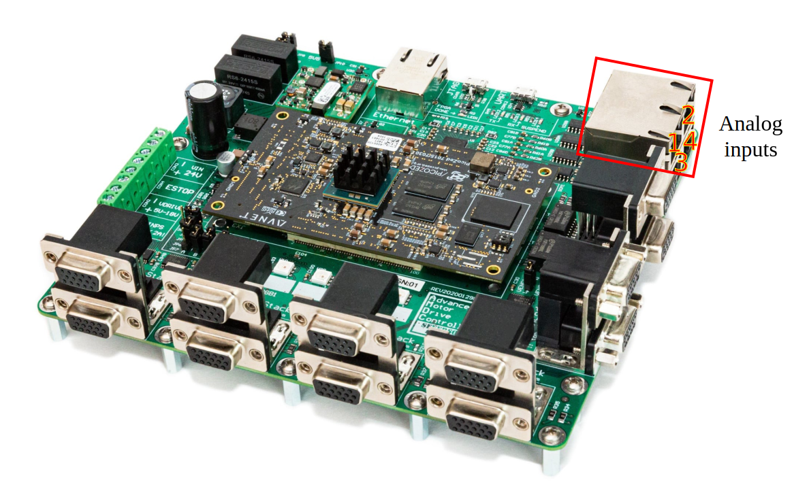

# AMDC Analog Input

This document describes the design considerations and implementation details for the analog input subsystem on the Advanced Motor Drive Controller (AMDC). A block diagram is presented and each component discussed in detail. Specifications of each component are provided based on the datasheet.

## Relevant Versions of AMDC Hardware

AMDC REV D

## Design Requirements and Considerations

There are several design requirements that must be met for the analog signal chain of the AMDC:

1. Synchronously digitize differential analog inputs (bipolar, ±10V at each input of the differential signal).
2. Operate ADC fast enough such that the sampling can be aligned to the PWM carrier waveform (>100ksps throughput on all channels with the accurate timing).
3. High impedance inputs so no possiblity for the ground loops.
4. High common-mode rejection ratio (CMRR) for a wide range of inputs.
5. Low noise signal chain.

As it was mentioned, the analog input to the AMDC should be bipolar differential with the voltage within ±10V. Then, the analog front-end converts this into a pseudo-differential bipolar signal which is needed by the analog-to-digital converter (ADC). More information on the ADC input types and their definitions can be found [here](https://www.analog.com/media/en/technical-documentation/product-selector-card/2PB_sarinputtypesfb.pdf).

## Block Diagram / External Connections

### Analog connectors
The analog signal chain of the AMDC can receive up to 8 bipolar differential analog inputs (16 signals in total – 8 positive and 8 negative). There are 4 analog connectors (modular jacks) each receiving up to 2 differential inputs. There are also 4 ESD protection chips to protect the sensitive electronics from the damage due to ESD.

A table of the pin mappings for the `Analog connector 1` is shown below:

| Pin number | Signal name |
|------------|--------|
| 1 | `Analog P1` |
| 2 | `Analog N1` |
| 3 | +15V |
| 4 | `GND` |
| 5 | -15V |
| 6 | `GND` |
| 7 | `Analog P2` |
| 8 | `Analog N2` |

The location of these 4 analog connectors in the AMDC (stacked as 2 x 2) is shown below:

In this picture, the top left connector (when looking from the right side) corresponds to the `Analog connector 1` in the block diagram, the top right connector is the `Analog connector 2`, the bottom left connector is the `Analog connector 3`, and the bottom right connector is the `Analog connector 4`.

More detailed information on the analog connectors can be found in the [datasheet](https://media.digikey.com/pdf/Data%20Sheets/Amphenol%20PDFs/RJSAE_Brochure.pdf).

### Difference amplifiers
Analog input signals should be conditioned before transmitting to the ADC. The first stage of this conditioning is to decrease the voltage level. These are implemented using 4 [INA2143UA](http://www.ti.com/lit/ds/symlink/ina143.pdf) difference amplifier chips. Each chip has two op amps, totaling in 8 op amps each of which receives one differential analog input. These chips need a ±15V supply which they receive from the AMDC. Each op amp is configured as a non-inverting amplifier and the relationship between its input and output is as follows:

_V_i = _V_REF  + 0.1 (_V_i+ - _V_i-)

where i = 1, 2, 3 ..., 8. (_V_i+ - _V_i-) is the bipolar differential input coming from analog connectors and _V_i is the output of the op amp which is fed to the low-pass filter (next subsection). _V_REF = 2.048V is supplied from the AMDC and 0.1 gain is set using the laser trimmed resistors during IC fab, so each resistance value internal to the [INA2143UA](http://www.ti.com/lit/ds/symlink/ina143.pdf) is very accurate. This results in a very high CMRR. The differential input to the op amp can be between ±20V (AC/DC, each input between ±10V), which means the output can be in the range of 0.048V and 4.048V. The voltage level at each stage of the analog signal chain is shown by a red color in the block diagram.

More detailed information on the operating conditions of the op amp can be found in the [datasheet](http://www.ti.com/lit/ds/symlink/ina143.pdf).
 
### Low-Pass Filters (LPFs)
After the analog input voltage levels are decreased using the op amps, the next stage is to remove the high-frequency noises using the low-pass filters. To implement this, 8 simple first-order RC filters are used each for 1 analog input. The cutoff frequency of the filter is selected based on the resistance and capacitance values:

_f_c = 1 / (2 π _RC_)

The main purpose of these LPFs, however, is for anti-aliasing. They are set to 50kHz (a resistor with _R_ = 100Ω and a capacitor with _C_ = 33nF) since sampling is nominally done at 100kHz for the ADC, and the control loop is nominally at 10 or 20kHz. 

The nominal build of the AMDC sets RC values to get 50 kHz bandwidth, but the custom builds can use different RC values to obtain a different filter bandwidth.

### ADC

After the analog input signal passes through analog front-end (voltage level decreased and high-frequeny noise removed), it can be inputted to the ADC to convert to digital signal. [LTC2320-14](https://www.analog.com/media/en/technical-documentation/data-sheets/232014fa.pdf) high speed octal 14-bit + sign successive approximation register (SAR) ADC is used for this purpose which can receive up to 8 inputs. ADC chip is supplied by 5V from the AMDC to operate.

Each analog input to the ADC is configured as a pseudo-differential bipolar signal - its positive input signal is single-ended LPF output that can swing between 0.048V and 4.048V, and its negative input signal is at _V_REF = 2.048V, resulting in a differential input span of ±2V which is digitized by ADC.

The outputs of the ADC chip are 8 serial data outputs each resulting from 1 differential analog input. The chip is also supplied by 1.8V which is used as a digital HIGH of the output signal. These 8 digital signals are then transmitted to the Picozed. There are other 3 digital signals (`ADC CNV`, `ADC SCK` and `ADC CLKOUT`) needed for the interface with FPGA.

To view the mapping between the AMDC schematic labels, PicoZed pins, and Zynq-7000 balls used in Vivado, take a look at the analog section of the [pin mapping document](RevD-PinMapping.md#analog).

More detailed information on the operating conditions of the ADC can be found in the [datasheet](https://www.analog.com/media/en/technical-documentation/data-sheets/232014fa.pdf).

## PCB Layout

Analog connectors, difference amplifier chips and LPFs are located on the top layer, while ESD protection chips are located on the bottom layer. The bottom layer is used to route the signals from the analog connectors to the ESD protection chips and the difference amplifiers, and from the LPFs to the ADC. The top layer is used to route the signals from difference amplifiers to the LPFs. All signal traces have a 6mil thickness. Supply and ground traces connected to the chips have a thickness of 10mil.

## Datasheets

- Analog connectors - https://media.digikey.com/pdf/Data%20Sheets/Amphenol%20PDFs/RJSAE_Brochure.pdf
- ESD protection - http://www.smc-diodes.com/propdf/SMDA03C%20THRU%20SMDA24C%20N0297%20REV.B.pdf
- Difference amplifiers - http://www.ti.com/lit/ds/symlink/ina143.pdf
- ADC – https://www.analog.com/media/en/technical-documentation/data-sheets/232014fa.pdf
