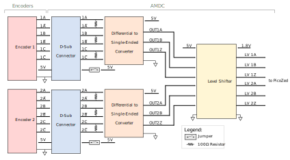
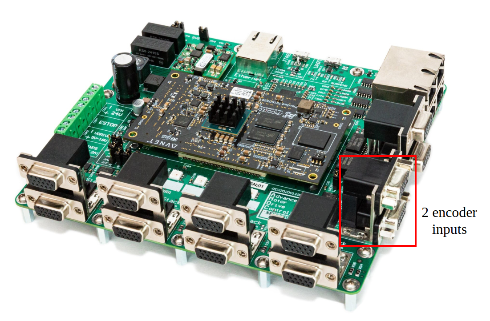

# AMDC Encoder Input

This document describes the design considerations and implementation details for the encoder input subsystem on the Advanced Motor Drive Controller (AMDC). A block diagram is presented and each component is discussed in detail. Specifications of each component are provided based on the datasheet.

# Relevant Versions of AMDC Hardware

AMDC REV D

## Design Requirements

There are two design requirements that must be met for the encoder subsystem of the AMDC:

1. Interface standard differential incremental encoders (5V differential unipolar signals) to FPGA.

2. Provide a high-bandwidth front-end so that the encoder line count is limited by the FPGA speed, not circuitry.

## Block Diagram

### 1. Encoders

The AMDC REV D hardware supports two independent encoder interfaces. These must be incremental encoders outputting differential ABZ signals (i.e. the encoder outputs both the non-inverting and inverting signal, e.g. A and A̅). If the encoder only provides single-ended ABZ outputs, an adapter must be used between the encoder and the AMDC which converts the single-ended outputs to the differential signals required by the AMDC. For proper operation, the encoder ground should be connected to the AMDC ground via a pin on the DB9 connector. For powering the encoder, the user has two options: the AMDC provides 5V power via the DB9 connector, or the user can use an external power supply.

### 2. DB9 Connector

Each D-sub connecter has 9 pins – 6 for the differential ABZ signals, 2 for the ground signals and 1 for 5V supply to the encoder. A jumper should be installed if the encoder is powered by 5V from the AMDC. There are two jumpers numbered on the silkscreen as JP2 for Encoder 1 and JP3 for Encoder 2, as shown in the block diagram. Encoder 1 and Encoder 2 correspond to the top and bottom encoders in the picture below.

A table of the pin mappings for each D-Sub connector is shown below:

| Pin number | Signal name |
|------------|--------|
| 1 | A |
| 2 | A̅ |
| 3 | B |
| 4 | B̅ |
| 5 | Z |
| 6 | Z̅ |
| 7 | 5V |
| 8 | GND |
| 9 | GND |

To view the mapping between the AMDC schematic labels, PicoZed pins, and Zynq-7000 balls used in Vivado, take a look at the encoder  section of the [pin mapping document](RevD-PinMapping.md#encoder).

Location of these encoder connectors in the AMDC is shown below:

More information on the D-sub connector can be found [here]( https://www.alliedelec.com/m/d/c3366066d9274ddf3c20bc3008518f5b.pdf?src-supplier=Allied+Electronics).

### 3. Differential to Single-Ended Conversion

After passing through the D-sub connector, the differential ABZ signals (A, A̅, A, B̅, Z, Z̅) are converted to the single-ended ABZ signals (OUT A, OUT B, OUT Z) using the [AM26C32](http://www.ti.com/lit/ds/symlink/am26c32.pdf) chip. This chip is supplied by a `Vcc = 5V DC` source from the AMDC. The following table summarizes the absolute maximum ratings taken from the datasheet for this chip:

| Parameter                            | MIN    | MAX           |
|--------------------------------------|--------|---------------|
| Supply voltage Vcc                   |        | 7V           |
| Input voltage (A, A̅, A, B̅, Z or Z̅)   | -11V  | 14V          |
| Differential input voltage           | -14V  | 14V          |
| Output voltage (OUT A, OUT B, OUT Z) | -0.5V | (Vcc + 0.5)V |

Exposure to the absolute maximum ratings for an extended period of time may affect device reliability. Therefore, it is recommended to operate under the recommended operating conditions:

| Parameter                             | MIN   | NOM | MAX   |
|---------------------------------------|-------|-----|-------|
| Supply voltage Vcc                    | 4.5V | 5V | 5.5V |
| High-level input voltage (logic HIGH) | 2V   |     | Vcc   |
| Low-level input voltage (logic LOW)   | 0V   |     | 0.8V |
| Common-mode input voltage             | -7V  |     | 7V   |

When the chip is operated at nominal conditions (Vcc = 5V, room temperature 25C), the high-level output voltage is 3.8V or more and low-level output voltage is around 0.2V. The chip typically consumes about 10mA, which translates to about 50mW of the power consumption with the 5V supply. The rise and fall times of the output signal are both approximately equal to 4ns. Assuming the system as a first order, the maximum frequency the chip can reliably operate at is approximately 0.35/4ns = 87.5MHz.

Before connecting the encoder to the AMDC, the user should check if the encoder output signals satisfy recommended operating conditions of the chip. More detailed information on the operating conditions can be found in the [datasheet](http://www.ti.com/lit/ds/symlink/am26c32.pdf).

### 4. Level Shifter

After the encoder differential signals are converted to the single-ended, these signals are level-shifted/translated to a lower voltage, allowing compatibility with the PicoZed FPGA. The level shifter [SN74LVC8T245](http://www.ti.com/lit/ds/symlink/sn74lvc8t245.pdf) uses two separate configurable power-supply rails and allows for the bidirectional operation. Signals on each side (input or output) are referenced to their respective voltage rail. In the AMDC REV D design, the input voltage rail is at 5V and the output voltage rail is at 1.8V. The outputs of this chip (6 signals in total if 2 encoders are connected) are then transmitted to PicoZed. The rise and fall times of the output signal are both approximately equal to 1ns. Assuming the system as a first order, the maximum frequency the chip can reliably operate at is approximately 0.35/1ns = 350MHz.

## PCB Layout

All chips and D-sub connectors are located on the top layer. The top layer is used to route the signals from the D-sub connectors to the differential to single-ended converter then to the level shifter. The inner layers are used to route the signals from the level shifter to PicoZed. Each inverting and non-inverting pair of the encoder signals are terminated by a resistor on the bottom layer. All signal traces have a 6mil thickness. Supply and ground traces connected to the chips have a thickness of 10mil.
