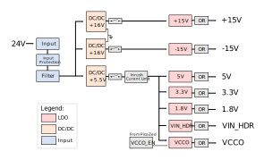

# AMDC Power Distribution

This document describes the design considerations and implementation details for the power distribution subsystem on the Advanced Motor Drive Controller (AMDC).

## Design Requirements and Considerations

The design requirements for the power input and distribution on the AMDC can be boiled down to a succient list of conflicting goals:

1. Single voltage input connection for all PCB power.
2. Efficient DC/DC conversion for various voltage rails (steady state should not be excessively hot for devices).
3. Low noise on power rails for circuitry (switching DC/DC are noisy; LDOs are preferred).
4. Power subsystem is not the main goal of AMDC, therefore BOM should be small and inexpensive.

The remainder of this document will summarize the resulting AMDC power system design and how it adheres to these goals.

## Block Diagram

## Schematics

The power subsystem is depicted in three schematic sheets:

- Top level sheet which shows filtering, DC/DCs and LDOs
- Subsheet which provides input protection (UV/OV, reverse input, etc)
- Subsheet which provides inrush current limiting on the 5.5V rail

The logical flow of power through the power conditioning system is now described.

### 1. Input

A screw terminal is the main source power. The nominal voltag is 24V, but can support 20-34V range.

### 2. Power Protection

To protect the circuitry on the AMDC from over-voltage, under-voltage, and reverse voltage input, back-to-back series MOSFETs are used  to act as a switch for input voltage. The gates of these MOSFETs are controlled the the LTC4365 device, which is configured to only allow a certian range of voltages. See the note in the schematics for calculation of the resistor values.

### 3. Filtering

Once the power protection circuitry has "approved" the input voltage, it then passes through a Class B EMC Emissions filtering stage. This consists of inductors and capacitors which prevent the source for being affected by poor dynamic AMDC power draw.

### 4. Large DC/DC Conversion

The filtered input voltage of 24V is then used by three DC/DC converters to efficiently buck the voltage down to levels needed by the circuitry.

- 24V to 5V (trimmed to 5.5V)
- 24V to 15V (trimmed to 16V)
- 24V to 15V (trimmed to 16V)

All three DC/DCs are trimmed such that their output is +10% higher than the required voltage so that LDOs can be used later (i.e. 5.5V is the DC/DC output so that a 5V LDO can be used). Note that two different versions of the DC/DCs are available, with the only different being where the trim resistor goes. Both footprints are provided on the AMDC to allow user BOM flexibility, and one is marked DNP.

The two 15V DC/DC are isolated, which means that their outputs can be used in series to create both positive and negative voltage rails (+/-15V).

The output of the 5V DC/DC is used by the majority of the AMDC (PicoZed, nearly all ICs, etc), and thus has a large amount of bulk capacitence on its output. In prior AMDC designs, issues arose when the 5V DC/DC output was directly connected to the rest of the board -- the inrush current caused the DC/DC to current limit and turn itself off. Once it was off, it tried turning back on, thus repeating the cycle and causing a "hiccuping" effect. To solve this, the inrush limiting block is used on the 5V DC/DC output. The main device behind this is the TI TPS22965, a load switch with adjustable rise time. The rise time, set by external capacitor, is set such that the DC/DC does not register a current limiting event. Calculations are provided in the schematics to size this capacitor, but a slower rise time is used in the final design which resulted from experimental test data.

### 5. Small LDO Conversion

Discussion related to schematics for power subsystem:
- Related screenshots
- Hierarchy
- 2 differnet DC/DC available, with different enable logic (DNP resistor)
- Power protection calculations
- Inrush current limiting calculations
- etc

## PCB Layout

Discussion related to PCB layout for power subsystem:
- What area of board is it on?
- Switching vs LDOs noise
- Trace width

## Voltage Rails / Max Current Limitations

List of voltage rails on AMDC and what they power.
Probably table with subsystem, voltage rails, power draw, etc

## Datasheets

Appendix with links to relevant datasheets for the parts on the AMDC... DC/DCs, LDOs, power protection, etc.
