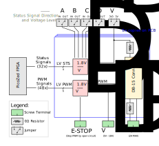
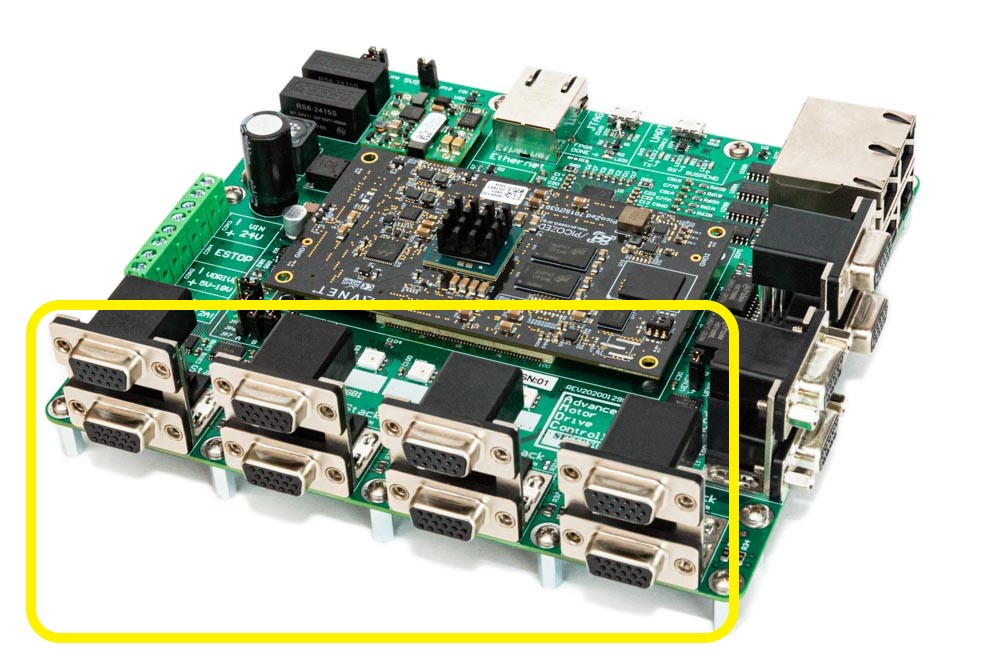
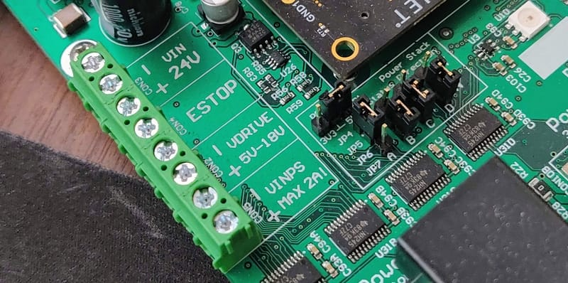

# AMDC Power Stack Interface

This document describes the design considerations and implementation details for the power stack interface subsystem on the Advanced Motor Drive Controller (AMDC).

## Relevant Versions of AMDC Hardware

AMDC REV D

## Design Requirements and Considerations

The power stack interface was designed with the following requirements:

- Drive 8 three-phase two-level inverters (6 PWM signals each)
- Support status monitoring for each inverter (4 I/O channels each)
- Configurable voltage level for PWM signals
- Configurable voltage level and direction for status line I/O
- Provide power distribution from seperate AMDC screw terminals to all power stacks
- Hardware E-STOP functionality to disable all PWM (no firmware needed)

## Block Diagram

The full power stack interface block diagram is shown above. It is compacted into 8x duplicated channels for easy representation. The connectors and jumpers depicted *outside* of the blue box are not replicated on the PCB.

Each DB-15 connector is designed to control a single three-phase two-level inverter. This includes six PWM signals and four status signals. The user can configure the voltage for both the status and PWM signals independently. The user can also supply each inverter with a power supply designed to run the gate drivers that is distributed through the AMDC; this reduces wire routing overall. Finally, all PWM outputs are only enabled when the E-STOP input is disabled. If the E-STOP input becomes open-circuit, all PWM signals go to a low state, thus turning off all switches.

### 1. PWM Signals

The PWM gate drive signals are generated by the PicoZed FPGA at 1.8V. These are then level-shifted up to the user-supplied `VDRIVE` voltage. Each PWM signal then goes to the DB-15 connector. Each PWM signal is ANDed with the E-STOP signal. Thus, when the E-STOP is opened, the PWM signals go to a logic low state.

### 2. Status Signals

Each inverter has four status lines (labeled A, B, C, and D). These signals operate at the `VDD` voltage level, which is configurable by the jumper on the PCB. Each status line (A/B/C/D) can be configured as either an input or output, depending on the jumper selection. Note that all eight inverters use the same directionality for the status signals (i.e. if status signal A is an input, it is an input for all eight inverters).

These status signals can be used as arbitrary I/O between the AMDC and the power stack. Typically, they are used to read fault states, reset the power stack, read ready states from the power stack gate drives, etc. The voltage level which is selected by the jumper on the AMDC is supplied to each DB-15 connector so the power stack can use the correct I/O voltage level for communication.

#### Jumpers

On the AMDC, the following are the jumpers used to set status line voltage level and direction:

- JP1: Status voltage level
- JP4: Status A direction
- JP5: Status B direction
- JP6: Status C direction
- JP7: Status D direction

### 3. Voltage Rails

There are three voltage rails which must be understood for the power stack interface: `VDD`, `VDRIVE`, and `VPS`.

The AMDC as a whole has various voltage rails which are outlined in the [Power Distribution document](PowerDistribution.md). However, the power stack interface subsystem adds two extra voltage rails to the mix: `VDRIVE` and `VPS`. These are user-supplied via external inputs. The power stack `VDD` rail is jumpered to either the main `5V` or `3.3V` rail.

#### `VPS` &mdash; *Power Stack General Voltage Supply*

This voltage rail (the "power stack voltage rail") is completely independent from the AMDC; the AMDC simply acts as a power distribution network for this rail. On the AMDC, one screw terminal input is used to supply both the + and - rail of `VPS`. Then, the AMDC routing distributes this power rail to each DB-15 connector. This power rail is designed to supply the bulk power required by the power stack gate drivers. Usually, 12V or 24V is used for this. Note that the AMDC trace routing for this signal can only support 2A. At 24V, this would mean 48W power consumption for all power stack gate drives (or 6W each). If the user needs a more powerful gate drive, they must use an external power source for it.

Note that this voltage rail passes through a 1206 0R resistor for each DB-15 connector (i.e. each inverter). Thus, the user may depopulate this resistor if needed to remove this voltage rail from the connector.

#### `VDRIVE` &mdash; *Power Stack PWM Voltage Level*

This voltage rail (the "power stack PWM drive voltage") is supplied via the AMDC screw terminal input. This sets the voltage level used for the PWM signals that go to the power stacks. The user *must* supply a valid voltage at this input for the PWM outputs to function (5V to 18V). The PWM voltages will then be square waves which go between 0V (the AMDC `GND`) and the user-supplied `VDRIVE`. Note that this signal is NOT intended to directly drive the power electronic switch gates in the power stack; this signal controls the gate drive circuitry on the power stack. For high noise immunity, use larger `VDRIVE` voltages. Nominally, 5V is fine if proper shielding is used to block EMI.

##### Power Requirements for `VDRIVE`

The external `VDRIVE` supply only powers the AMDC PWM circuitry, not the gate drives themselves. Therefore, the power drawn from the external `VDRIVE` supply can be approximated as depending on the PWM switching frequency fsw, the `VDRIVE` voltage level, and the total line capacitance Ctotal between the AMDC and the power stacks:

PVDRIVE = fsw * Ctotal * `VDRIVE`2

Given typical values fsw = 100kHz, Ctotal = 10nF, `VDRIVE` = 5V, then the current draw on the external 5V power supply is 5mA.

#### `VDD` &mdash; *Power Stack Status Voltage Level*

This voltage rail (the "power stack status line voltage") is either 5V or 3.3V, and is selected using the jumper on the AMDC. This voltage is used for the logic high level of the status line signals between the AMDC and the power stack. The logic low level is the 0V AMDC `GND` signal. This voltage is supplied to each DB-15 connector so the power stack can appropriately drive the status lines.

Note that this voltage rail passes through a 1206 0R resistor for each DB-15 connector (i.e. each inverter). Thus, the user may depopulate this resistor if needed to remove this voltage rail from the connector.

##### Power Requirements for `VDD`

`VDD` is supplied by the internal `5V` or `3.3V` rail on the AMDC. This rail is typically not used as power for dynamic switching, since it is the I/O voltage level for the status lines. The status signals are typically DC values. Therefore, the power drawn from the internal AMDC rails is negligible compared to their capability.

## DB-15 Connectors

The AMDC has 8x DB-15 connectors, one for each of the eight inverters. The DB-15 connectors are grouped into stacks of two, so there are four total stacks of DB-15 connectors across the front of the PCB. In the schematics, the top DB-15 connector in each stack is labeled as `A` and the bottom as `B`. The inverter numbering is as follows:

| Silkscreen Label | Top / Bottom | Inverter # |
|------------------|--------------|------------|
| `CON10A`         | Top          | `INV 1`    |
| `CON10A`         | Bottom       | `INV 2`    |
| `CON10B`         | Top          | `INV 3`    |
| `CON10B`         | Bottom       | `INV 4`    |
| `CON10C`         | Top          | `INV 5`    |
| `CON10C`         | Bottom       | `INV 6`    |
| `CON10D`         | Top          | `INV 7`    |
| `CON10D`         | Bottom       | `INV 8`    |

### DB-15 Connector Pinout

Each DB-15 connector uses the same pinout, but for its own inverter. For example, the top DB-15 of `CON10A` supplies the PWM and status signals for inverter #1, while the bottom DB-15 of `CON10D` is mapped to inverter #8.

Each DB-15 connector has three rows of pins (uses the high-density DB-15 format). The connector has tiny labels next to each pin hole which map to the schematic labeling. The following table indicates the pinout for each connector:

| Pin # | Signal Name |
|-------|-------------|
| 1     | `PWM_1`     |
| 2     | `PWM_2`     |
| 3     | `PWM_3`     |
| 4     | `PWM_4`     |
| 5     | `PWM_5`     |
| 6     | `PWM_6`     |
| 7     | `GND`       |
| 8     | `STS_A`     |
| 9     | `STS_B`     |
| 10    | `STS_C`     |
| 11    | `STS_D`     |
| 12    | `VPS`       |
| 13    | `VDD`       |
| 14    | `GNDPS`     |
| 15    | `GND`       |

The mapping between `PWM*` signals in the above table and the "correct" power stack switch locations is not fixed in nature; this depends on the FPGA firmware being used. Typically, the odd-numbered PWM signals drive the high-side switches, while the even-numbered signals drive the low-side switches. However, this can be changed arbitarily in the FPGA firmware. In general, the PWM signals are just arbitrary outputs -- they can be driven to any sequence in the FPGA and used in any way in the power stack.

For the default PWM firmware driver implementation, setting the duty ratio command for "PWM 0" results in inverter #1 (`INV1`): `PWM1` and `PWM2` being set to the desired duty ratios. These signals will then appear at `CON10A`, pins 1 and 2. The voltage level will toggle between 0V (AMDC `GND`) and the user-supplied `VDRIVE`. Setting "PWM 1" in firmware simply increments the `PWM*` signal locations, so would correspond to `INV1`: `PWM3` and `PWM4`. This continues on, cycles through each inverter number sequentially. The last one, "PWM 23", would appear at `INV8`: `PWM5` and `PWM6`.

## PCB Layout

The PCB layout is important for the high-speed digital PWM signals. The 48x PWM signals are spaced out on the PCB such that there is reduced capacitive coupling between them during signal switching edges. The power supply rail traces are thicker than other traces to accommodate the required current rating while minimally heating up the circuit board.

## Datasheets

- [1.8V compatible level shifter IC (SN74LVC8T245)](http://www.ti.com/lit/ds/symlink/sn74lvc8t245.pdf?&ts=1589402166354)
- [5V to `VDRIVE` level shifter + AND gate IC (TC4468)](http://ww1.microchip.com/downloads/en/DeviceDoc/21425C.pdf)
- [Stacked 2x DB-15 connector (178-H15-513R497)](https://content.norcomp.net/rohspdfs/Connectors/17Y/178/513/178-H15-513R497.pdf)
