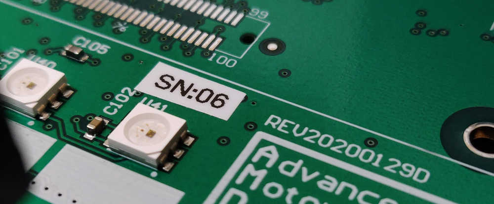
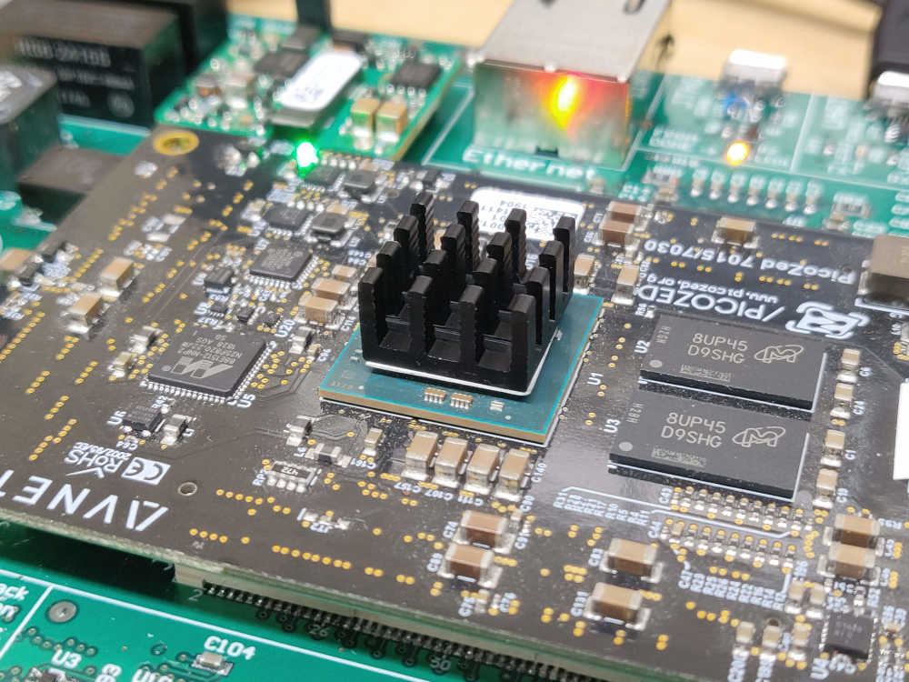
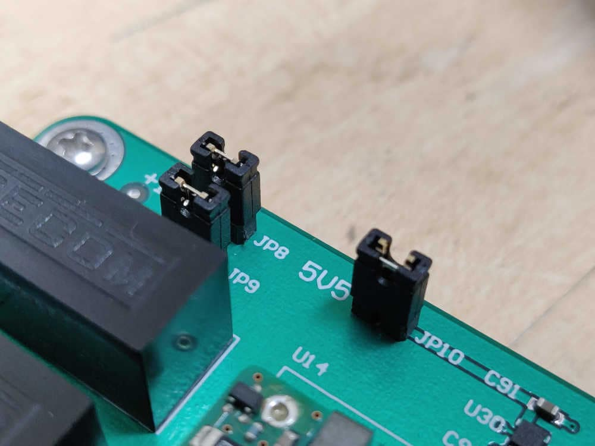
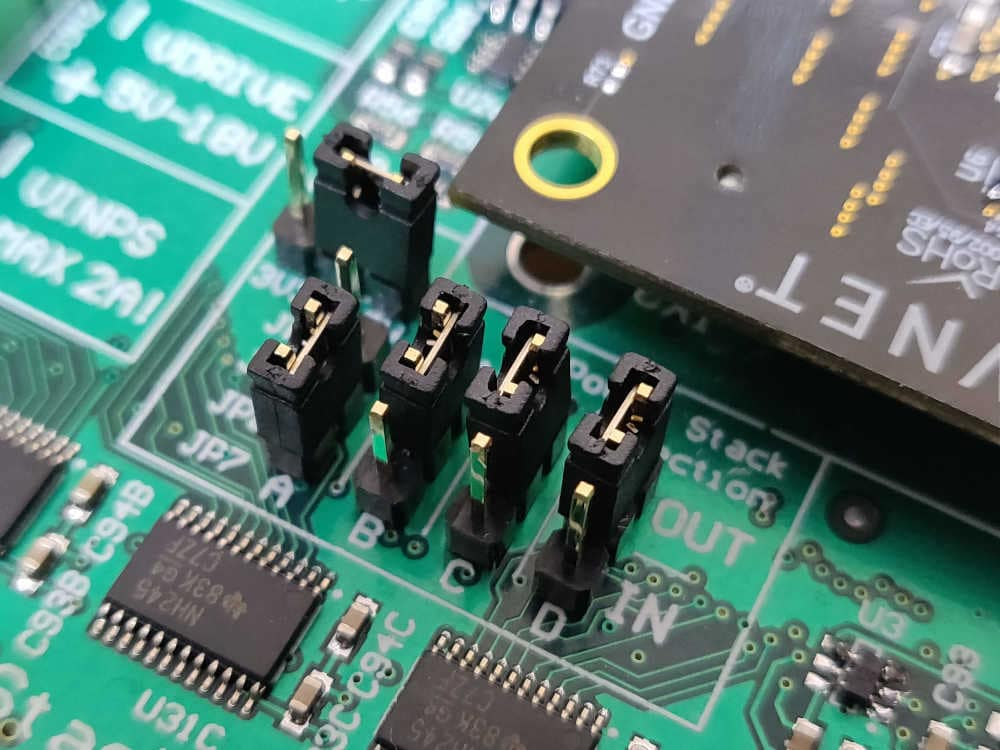
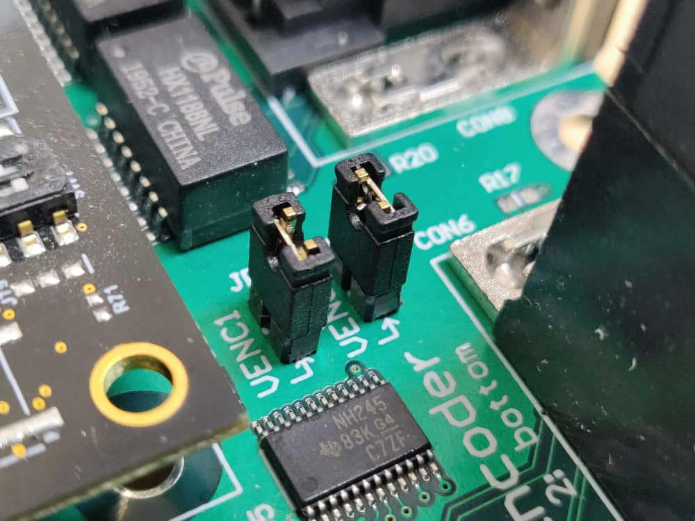
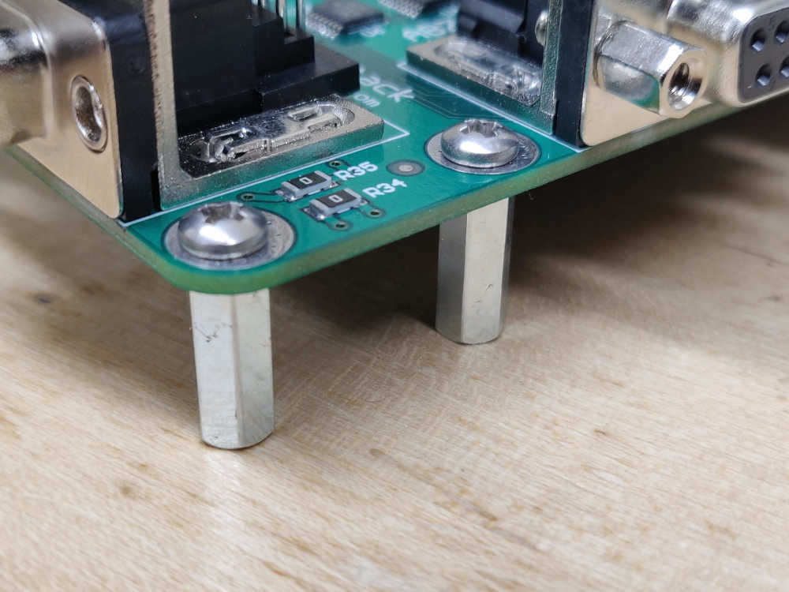

# AMDC REV D Bring-Up

New hardware bring-up is a critical step in the development process. A systematic method must be followed to ensure the PCB functions as expected. This document describes these steps and should be followed when bringing up a new REV D AMDC board.

For reference, the AMDC REV D schematics are available [here](https://github.com/Severson-Group/AMDC-Hardware/raw/develop/REV20200129D/AMDC_v4_sch.pdf).

#### Read background information

1. Read all subsystem documentation so you understand the different parts of hardware design / implementation. Pay special attention to the power distribution document as we will be referencing it later.
    1. [Analog](Analog.md)
    2. [Encoder](Encoder.md)
    3. [Power Distribution](PowerDistribution.md)
    4. [Power Stack](PowerStack.md)
    5. [isoSPI](isoSPI.md)

#### Rework hardware

2. Read about design errata and ensure the required rework has been completed on the PCB (see [this document](RevD-Errata.md)).

3. Inspect board for obvious issues and resolve them:
    1. Unwanted solder bridges between pads / pins
    2. Component orientation mistakes
    3. Missing parts

4. At this point, you should understand the basics of the AMDC hardware design and are confident that no obvious issues are present on the PCB.

#### Configure PCB for bring-up

5. Print serial number label for both the AMDC PCB and PicoZed and update board log.

6. Install miscellaneous hardware parts:
    1. PicoZed heatsink (e.g. [P/N on Digi-Key](https://www.digikey.com/products/en?keywords=1528-1697-ND))
    
    
    2. All jumpers
    
    
    
    
    3. All stand-offs (do not leave any off since board flexes when PicoZed is installed)
    

7. Set jumpers for bring-up: when you first apply power to a board, you should isolate each power supply (if possible) and ensure they function as expected. See the [Power Distribution document](PowerDistribution.md) for a diagram of the jumper locations in the power flow path. Remove the jumpers after the DC/DC converters, before the LDOs (i.e. remove JP8, JP9, JP10).

8. Make sure the PicoZed is NOT plugged in.

#### Apply power and verify voltage regulator outputs

9. Apply input power at 24V, **with current limit of 500mA.** Make sure you are using an accurate DC power supply that can do accurate current limiting (try the Rigol DP832 supply). The AMDC should **not** draw 500mA. If it does, something is wrong -- immediately turn off power and debug the issue. A few watts should be consumed by the DC/DC converters at no load (i.e. jumpers disconnected at their outputs).

10. Measure the DC/DC voltage output. Note that the DC/DC converters are isolated, so the input ground of your power supply (`VIN-`) should not be connected to common on the AMDC (`GND`). Measure the +5.5V, +16V and -16V DC/DC outputs and ensure they are reasonably close to the desired voltage. If not, stop and debug.

11. Power off AMDC. Put each jumper (JP8, JP9, JP10) back on individually, powering board on between each. At each power on, ensure the power draw from your 24V DC supply is still reasonable (it should go up slightly). Measure the output of the LDOs connected to the jumper you attached (see schematics / power distribution doc for reference). Ensure LDO voltage outputs are correct.

10. Once you have validated all LDO voltage rails, put on all jumpers and make note of the power draw. It should be around 5W.

#### Validate USB interfaces (JTAG and UART)

11. With AMDC powered on, plug in JTAG USB cable to PC. You should hear a ding from your PC indicating it recognized the JTAG interface. If an error appears on your PC for the JTAG USB device (i.e. failed USB enumeration), you did not successfully swap the JTAG USB data lines. Rework and try again.

12. With AMDC powered on, plug in the USB UART cable to your PC. It should successfully enumerate and appear as the Silicon Labs CP210x interface bridge. If not, make sure you have the [correct drivers](https://www.silabs.com/products/development-tools/software/usb-to-uart-bridge-vcp-drivers) installed.

#### Validate PicoZed power draw

12. Turn board back off and carefully plug in the PicoZed.

13. Power on AMDC. Make sure power draw is still reasonable (~5W).

14. Make sure LEDs are on:
    1. One LED on PicoZed (indicates internal PicoZed power-on sequencing worked)
    2. Green and red LED (LED2 and LED3) on AMDC (indicates power to AMDC)

#### Bring-up complete

*Congratulations!* If you made it this far, you have successfully brought up a new REV D AMDC! At this point, you are ready to compile the firmware required by the Xilinx Zynq-7000 SoC on the PicoZed and program the AMDC. For steps on building / compiling the AMDC firmware, see the [AMDC-Firmware](https://github.com/Severson-Group/AMDC-Firmware) repo.
