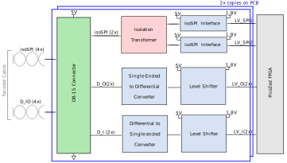
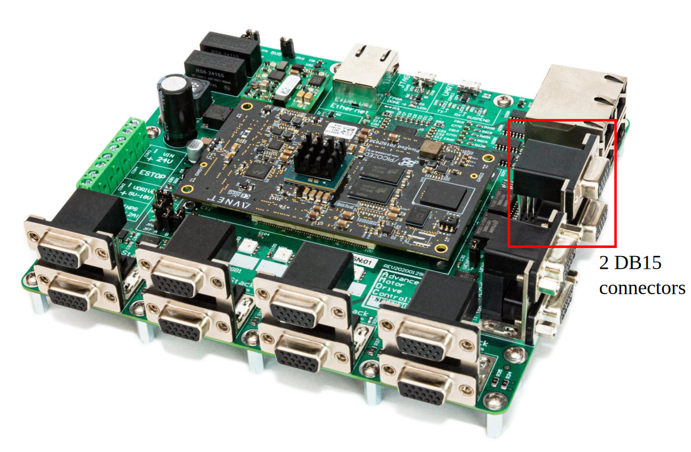

# AMDC isoSPI and differential I/O interface

This document describes the design considerations and implementation details for the isoSPI and differential I/O interface on the Advanced Motor Drive Controller (AMDC). The block diagram of the implementation is presented and each block is discussed in detail. The details on PCB layout, connector pinout are also provided in this document.

# Relevant Versions of AMDC Hardware

This document is relevant to AMDC REV D only.

## Design Requirements and Considerations

The isolated serial peripheral interface (isoSPI) has increased noise immunity and safety. The following describes the design requirements for the isoSPI and differential I/O (D_IO) interface.
1. Implement four isoSPI and four differential I/O interface.
2. Implement voltage level translator to interface with FPGA that operates at 1.8V.

## Block Diagram / External Connections

### 1. DB15 Connector

DB15 D-sub high-density connectors are used for isoSPI and differential I/O (D_I / D_O) interface in AMDC. There are 2 DB15 connectors and each connector has 2 isoSPI communication interface, 2 differential I/O interface, 1 pin for ground signals, and 1 pin for 5V supply from the AMDC.

The pin mappings for each DB15 connector is shown:

| Pin number | Signal name |
|------------|--------|
| 1 | 5V |
| 2 | D1_I_P |
| 3 | D1_I_N |
| 4 | D2_I_P |
| 5 | D2_I_N |
| 6 | NC |
| 7 | isoSPI1_P |
| 8 | isoSPI1_N |
| 9 | isoSPI2_P |
| 10 | isoSPI2_N |
| 11 | GND |
| 12 | D1_O_P |
| 13 | D1_O_N |
| 14 | D2_O_P |
| 15 | D2_O_N |

The mapping between the AMDC schematic labels, PicoZed pins, and Zynq-7000 balls used in Vivado, can be found at the isoSPI section of the [pin mapping document](RevD-PinMapping.md#encoder).

Location of these connectors in the AMDC is shown below:

More details on the DB15 connector can be found in [here](https://content.norcomp.net/rohspdfs/Connectors/17Y/178/513/178-H15-513R497.pdf)

### 2. isoSPI communication interface

The isoSPI communication interface is implemented using [LTC6820](https://www.analog.com/media/en/technical-documentation/data-sheets/LTC6820.pdf). This IC provides a bi-directional interface between standard SPI signals and differential pulses. The SPI signals from PicoZed are in 1.8V voltage level, this IC also translates the signals to 5V level. For termination, 120 ohms resistor is added. The maximum and minimum operating conditions are provided in the following table:

| Parameter                             |    Conditions     |   MIN   |  MAX  |
|---------------------------------------|-------------------|---------|-------|
| Supply voltage VDD (Differential side)|                   | 2.7 V   | 5.5 V |
| IO supply voltage VDDS (SPI side)     |                   | 1.7 V   | 5.5 V |
| High-level input voltage              |VDDS = 2.7V to 5V  | 0.7 VDDS| VDDS  |
| High-level input voltage              |VDDS = 1.7V to 2.7V| 0.8 VDDS| VDDS  |
| Low-level input voltage               |VDDS = 2.7V to 5V  | 0       | 0.3 VDDS  |
| Low-level input voltage               |VDDS = 1.7V to 2.7V| 0       | 0.2 VDDS  |

This IC can operate at a maximum SPI communication speed of 1 Mbps. The bias resistors (RB1 and RB2) are used to adjust the drive currents to the differential lines. The bias resistors (RB1 and RB2) used in the design will set the drive currents to 10 mA. The maximum supply current consumed by the IC including to drive currents for differential lines is 15.8 mA which corresponds to 79 mW for 5 V supply. More information regarding the operating conditions, bias resistors, maximum throughput rate, can be found in the [datasheet](https://www.analog.com/media/en/technical-documentation/data-sheets/LTC6820.pdf). 

### 3. isoSPI isolation transformer

To add isolation to the differential isoSPI signals, an external isolation barrier is required. This is implemented by adding pulse transformer HX1188NLT, which has 1:1 turns ratio. More information on the pulse transformer is found in the [datasheet](https://media.digikey.com/pdf/Data%20Sheets/Pulse%20PDFs/10_100BASE-T%20Single%20Port%20SMD%20Magnetics_Rev2008.pdf).

### 4. Single-ended to differential converter

The I/O interface is connected to the FPGA I/O pins of PicoZed which can be configured as SPI, UART or any other communication interface. This signal is converted into differential I/O using AM26C31 differential line driver. The operating conditions for the IC are provided in the following table.
| Parameter                             | MIN   | NOM | MAX   |
|---------------------------------------|-------|-----|-------|
| Supply voltage Vcc                    | 4.5 V | 5 V | 5.5 V |
| Input voltage range                   | -0.5 V|     | Vcc + 0.5 V  |
| High-level input voltage              | 2 V   |     | Vcc   |
| Low-level input voltage               | 0 V   |     | 0.8 V |

The maximum supply current consumed by the IC including to drive currents for differential lines is around 20 mA which corresponds to 100 mW for 5 V supply. For more information refer to the datasheet of [AM26C31](http://www.ti.com/lit/ds/symlink/am26c31.pdf?HQS=TI-null-null-digikeymode-df-pf-null-wwe&ts=1590045318995).

### 5. Differential to single-ended converter

The differential signal is converted into single-ended signal using AM26C32 differential line receiver. The operating conditions for the IC are provided in the following table.
| Parameter                             | MIN   | NOM | MAX   |
|---------------------------------------|-------|-----|-------|
| Supply voltage Vcc                    | 4.5 V | 5 V | 5.5 V |
| Common-mode input voltage             | -7 V  |     | +7 V  |
| High-level input voltage              | 2 V   |     | Vcc   |
| Low-level input voltage               | 0 V   |     | 0.8 V |

The maximum supply current consumed by the IC including to drive currents for differential lines is around 10 mA which corresponds to 50 mW for 5 V supply. For more information refer to the datasheet of [AM26C32](http://www.ti.com/lit/ds/symlink/am26c32.pdf?HQS=TI-null-null-digikeymode-df-pf-null-wwe&ts=1590045351338).

### 6. Voltage level shifter

The 5V voltage level from the differential line receiver is translated to a low voltage level (1.8V) for PicoZed using the level translation SN74LVC8T245 IC. This IC supports bi-directional translation, this is also used to translate the low-voltage level (from PicoZed) to 5 V level used by diferential line driver. The voltage levels are translated based on the supply voltage rail A (VCCA) and supply voltage rail B (VCCB). The direction can be set using direction control pin (DIR), the high on DIR pin translates the signals from A to B and low on DIR translates the signals from B to A. The operating voltage range for both A and B ports is from 1.65 V to 5.5 V.  For more information refer the IC [datasheet](http://www.ti.com/lit/ds/symlink/sn74lvc8t245.pdf?HQS=TI-null-null-digikeymode-df-pf-null-wwe&ts=1590052474879).    

## PCB Layout

The DB15 connector and the pulse transformer are located on the top layer. The isoSPI interfacing IC, differential line driver, receiver, and voltage translator ICs are located on the bottom layer. The top layer is used to route the signals from the DB15 connector to the pulse transformer. Inner signal layer 2 and 3 are used to route the signals from DB15 connector to the differential line driver and receiver ICs. The remaining signals from the ICs to the PicoZed connector are routed using the bottom layer. All the ICs consume less than 100 mA, so the 10 mil thickness trace is used for power supply traces. Most of the signal traces are routed using 6 mil trace thickness.

